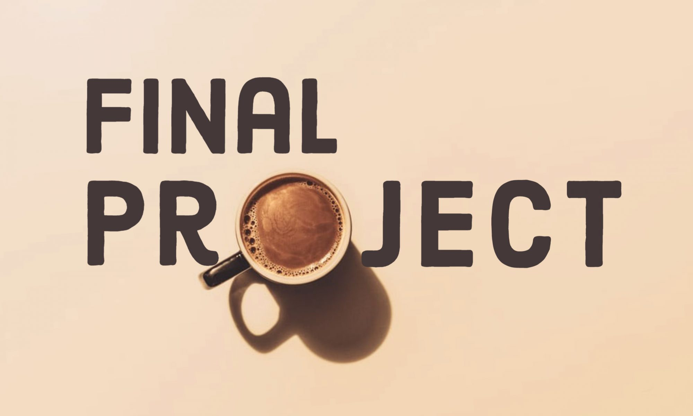

# Final Project

<aside>

👥 **This is a team project with maximum of 3 in a group**. 
- You can work with teammates you’ve worked with before, or find new teammates. 
- Communicate with your teammates, then schedule time to work on the project.
- Each team will choose which project they want to work on. 
- Dataset will be provided to you once you notify the Instructor with the project you want to work on. 
  - You can send an email to the Instructor as a team explaining the project and requesting for a dataset.
- ONLY use the dataset provided by the Instructor
- An individual cannot be the only one in a team. So start forming your team now!

</aside>

# Description

Your final project will involve all topics covered from week 2 to 8 by using data to solve a real-life problem. Remember you're doing this with your team.

You’ve learned a ton about data collection and cleaning, visualization and insight, machine leearning, and model evaluation in this course. The final project is your chance to solve a problem with these from scratch.

<!--  -->

## Rubric

Use the rubric below as a guideline for your project as this will be used in grading your submissions.

| Points | Criteria | Description |
|---|---|---|
| 3 pts | Data  cleaning & preprocessing  | Demonstrate clear understanding of different data cleaning and preprocessing techniques by applying them to your dataset. 
 Clearly document (within the notebook) all cleaning and preprocessing steps. 
 |
| 3 pts | Exploratory Data Analysis  | Apply both measure of central tendency and dispersion to understand the data. 
 Perform corellation analysis of the dependent and independent variables 
 What does the corellation analysis says about the dependent and independent variables 
  |
| 4 pts | Data Visualization & Insight | Use at least 5 different visuals to tell a story about the data 
 Clearly document (within the notebook) 5 different insights you gained from the data 
|
| 2 pts | Feature Engineering | Convert categorical or non-numeric features into a numerical representation 
 Transform neccessary features using feature transformation techniques of your choice. 
 |
| 4 pts | Machine Learning | Use 2 different ML algorithms to build a model using your preprocessed data 
 Compare the 2 models based on their accuracy 
 Fine-tune or improve the model if the accuracy is poor. |
| 2 pts | Model Evaluation | Evaluate the 2 models using a **minimum** of 4 evaluation metrics 
  |
| 2 pts | Documentation | State clearly all the processes you've done and why you've chosen to do that. This is different from code comments 
 Take a cue from the Midterm Project|
| 4 pts | Record Video | Record a video (3mins max) showing what the project is about and **stating individual contributions** 
 Having good idea of the end-to-end processes in the project 
 You can submit your teams' video using **[this link](https://docs.google.com/forms/d/e/1FAIpQLSdDExkyHtKNooCdgaxWl5Y1sqZJ2d0LejP9shKO_7FKG3fkXg/viewform?usp=sharing)**  |
| 1 pts | Deployment | Able to deploy the ML model to cloud 
 Provides a live working URL to the deployed app in the last part of your `notebook`. I'll suggest you use **render** for deployment 
 |
| **25** | **Total** | **25 possible points with the bonus, scored out of 25** | 

## Project and Design Guidelines

Your team gets to decide the project for your final project. The challenge is to
choose a project that is exciting to you, but is not so big that it’s
overwhelming or impossible to complete.

Here’s some guidelines that can help you pick an exciting project you’ll be
able to complete.

- Your final project should be about as complicated as the most complicated
  exercises and projects you’ve already done, or maybe a little bit more advanced.
- Don’t plan to learn a whole new technology for the final project. Plan to use
  mostly what you’ve already learned (with a little bit more Googling for the
  things you run into along the way).

## How should you work together?

You’ll should figure out what works best for your team. The best teams communicate clearly up front, so that there isn’t confusion about what is going on. Try to agree on how you’ll communicate (Discord, Whatsapp, email, or something else), and when you’ll get together to work on the project.

It may be helpful to create a **design doc**. Using [Google docs](https://docs.google.com) or a text file in Repl.it, write down your ideas. You might include links, images, drawings, and text that helps to explain what you are planning to build.

A design doc can also help you track what work you’ve done, and what work is left to do.

### ✨✨Have fun!✨✨
