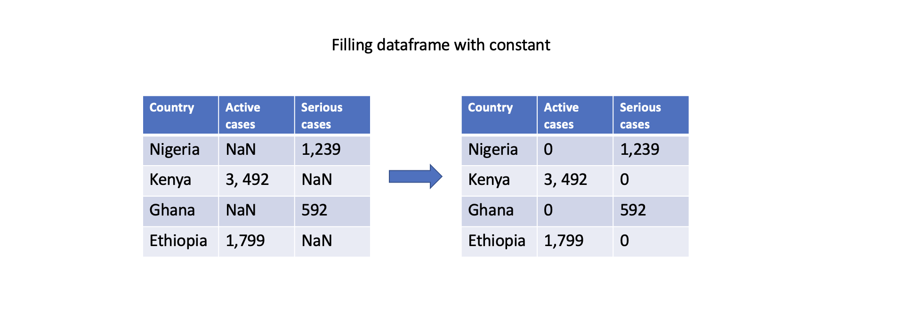
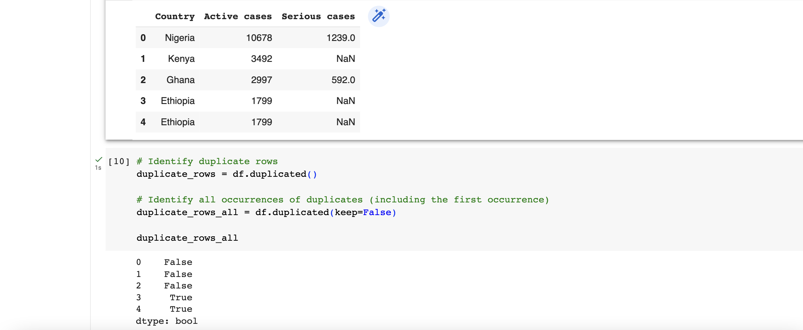
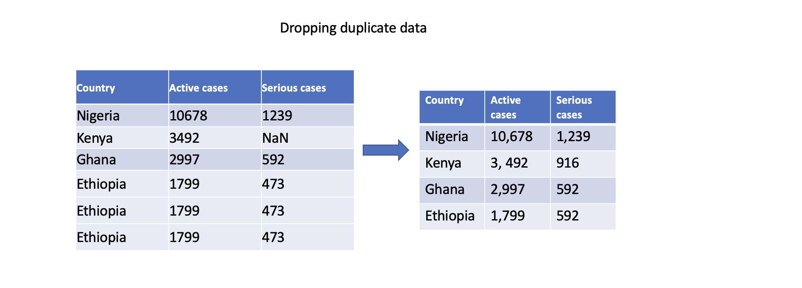
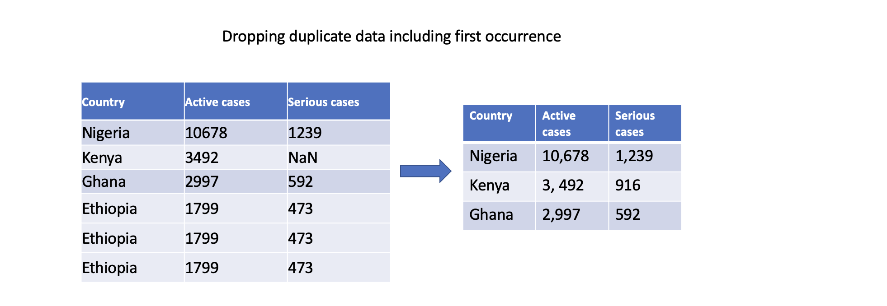
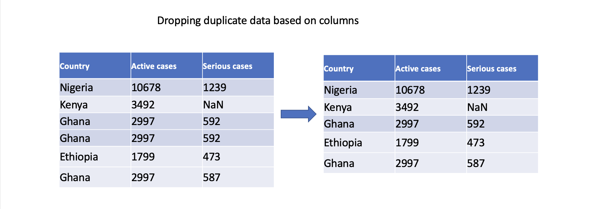

# 🔢 Data cleaning techniques
As a data scientist, we'll be working with lots of messy (or smelling 😖) data everyday. However, it is critical to ensure the accuracy, reliability, and integrity of the data by carefully _cleaning_ the data (without water 😁). In this lesson, we'll be looking at different data cleaning techniques needed to get the data ready for further analysis. First, we'll start by exploring techniques needed to handle `missing data`, and then we'll dive into what to do with `duplicate` data. 


<aside>

**_What is data cleaning?_**

_Data cleaning,_ also known as _data cleansing_ or _data preprocessing_. It involves identifying and correcting errors, inconsistencies, and inaccuracies in the dataset to ensure its quality and reliability for further analysis. 

</aside>

Data cleaning aims to improve the integrity, completeness, and consistency of the data. When cleaning a data, our goal will be to produce a clean and reliable dataset that is ready for further analysis. By investing time and effort into data cleaning, we can improve the accuracy and credibility of our analysis results, leading to more robust and reliable insights. To understand this more, we'll be looking at the following

- Handling missing data
- Removing duplicate data values 


<aside>

**Notes**
- We'll be using Pandas throught this lesson to clean our dataset.
- In a Pandas dataframe, missing values are represented with `NaN`.

</aside>


### 1. Handling missing data
Missing data is one of the most frequently occuring problems you can face as a data scientist. Watch the next video to have an idea of how important it is to understand this problem, and possible causes.

> 📺 How important are missing data? 👨🏾‍💻 

<div style="position: relative; padding-bottom: 56.25%; height: 0;"><iframe src="https://www.youtube.com/embed/BqtTcOtkp6Y" title="Web Scrapping Intro" frameborder="0" allow="accelerometer; autoplay; clipboard-write; encrypted-media; gyroscope; picture-in-picture" allowfullscreen style="position: absolute; top: 0; left: 0; width: 100%; height: 100%; border: 2px solid grey;"></iframe></div>

As a data scientist, there are many ways of dealing with missing values in a data. For this lesson, we'll be looking at 4 different techniques of handling missing data -  _dropping, filling with constant, filling with statistics, and _interpolation_. 

#### Dropping missing values
One straightforward approach is to remove rows or columns with missing values using the `dropna()` function. By specifying the appropriate axis parameter, you can drop either rows `(axis=0)` or columns `(axis=1)` that contain any missing values. However, this approach should be used with **caution** as it may result in a **loss of valuable data**.

```
    # Drop column with any missing values
    df.dropna(axis=1, inplace=True)

    # Drop rows with any missing values
    df.dropna(axis=0, inplace=True)
```


#### Filling with constant
You can also fill missing values with a constant value using the `fillna()` function. This can be done for specific columns or the entire DataFrame. For example, filling missing values with zero:

    # Fill missing values in a specific column
    df['Serious cases'].fillna(0, inplace=True)

    # Fill missing values in the entire DataFrame
    df.fillna(0, inplace=True)




#### Filling missing values with statistics
Another approach is to fill missing values with summary statistics, such as _mean, median_, or _mode_. Pandas provides convenient functions like `mean()`, `median()`, and `mode()` to compute these statistics. For example, filling missing values with the mean of column `Serious cases`:

    # Fill missing values in a specific column with the mean
    df['Serious cases'].fillna(df['Serious cases'].mean(), inplace=True)


#### Filling with interpolation
Pandas supports different interpolation methods to estimate (i.e., predict) missing values based on existing data points. The `interpolate()` function fills missing values using linear interpolation, polynomial interpolation, or other interpolation techniques.

    # Interpolate missing values in a specific column
    df['Serious cases'].interpolate(inplace=True)


These are just a few examples of how Pandas can handle missing data. The choice of approach depends on the specific dataset, the nature of the missing values, and the analysis goals. As a recap, watch the video below to summarize what has been discussed.

<div style="position: relative; padding-bottom: 56.25%; height: 0;"><iframe src="https://www.youtube.com/embed/v0HItX1xhNg" title="Web Scrapping Intro" frameborder="0" allow="accelerometer; autoplay; clipboard-write; encrypted-media; gyroscope; picture-in-picture" allowfullscreen style="position: absolute; top: 0; left: 0; width: 100%; height: 100%; border: 2px solid grey;"></iframe></div>


### 2. Removing duplicates
Duplicate data are rows or records within a dataset with similar or nearly identical values across all or most of their attributes.
This can occur due to various reasons, such as data entry errors, system glitches, or merging data from different sources. As a data scientist, there are number of ways to handle duplicate data in a small or large dataset. First, let's have a look at how we can identify if our data set has duplicate record, and in which column they exist.

#### Identifying duplicate data
To identify existence duplicate data in a dataset, the `duplicated()` function in Pandas is suitable for this. It returns a boolean value of either `True` or `False` for each of the rows. By using the `keep` parameter, you can control which occurrence of the duplicated values should be considered as non-duplicate. For example, we can check for duplicate using

    # Identify duplicate rows
    duplicate_rows = df.duplicated()

    # Identify all occurrences of duplicates (including the first occurrence)
    duplicate_rows_all = df.duplicated(keep=False)



#### Dropping duplicate data
To remove duplicate data, a common option is to drop (or remove) the entire row. There are 3 main types of data duplication -

- **Exact duplicates**: rows with the same values in all columns.
- **Partial duplicates**: rows with the same values in some columns.
- **Duplicate keys**: rows with the same values in one or more columns, but not all columns.

We'll only focus on exact duplicates in this section. To remove duplicate rows from a DataFrame, you can use the `drop_duplicates()` function. This function drops duplicate rows, keeping only the first occurrence by default. However, if you want to remove duplicates including the first occurence, then you can use the `keep` parameter.

    # Drop duplicate rows, keeping the first occurrence
    df.drop_duplicates(inplace=True)

    # Drop all occurrences of duplicates (keeping none)
    df.drop_duplicates(keep=False, inplace=True)




We can also specify specific columns to determine duplicates. Only rows with identical values in the specified columns will be considered duplicates.

    # Drop duplicate rows based on specific columns
    df.drop_duplicates(subset=['Serious cases'], inplace=True)



In conclusion, addressing duplicate data is crucial to ensuring accurate analysis, maintain data integrity, derive reliable insights, and support consistent decision-making. By effectively handling duplicate data, we can work with clean and reliable datasets, leading to more robust and trustworthy analysis outcomes.

### 👩🏾‍🎨 Check your understanding 🎯

Consider a dataset containing information about students' test scores and their demographic details. The dataset has missing values that need to be addressed before performing any analysis. Use the provided dataset to answer the following questions:

**Dataset:**

| Student_ID | Age | Gender | Test_Score | Study_Hours |
|------------|-----|--------|------------|-------------|
| 1          | 18  | Male   | 85         | 6           |
| 2          | 20  | Female | NaN        | 7           |
| 3          | 19  | Male   | 78         | NaN         |
| 4          | NaN | Female | 92         | 5           |
| 5          | 22  | Male   | NaN        | NaN         |

**Questions:**

1. What is missing data in a dataset?
2. Why is it important to handle missing data before performing analysis?
3. In the given dataset, how many missing values are in the "Test_Score" column?
4. How many missing values are in the "Study_Hours" column?
5. What are some common strategies to handle missing data? Briefly explain each.
6. For the `Test_Score` column, which strategy would you recommend to handle missing values? Why?
7. For the `Study_Hours` column, which strategy would you recommend to handle missing values? Why?
8. Can you suggest any Python libraries or functions that can help you handle missing data in a dataset?
9. Calculate the mean value of the `Test_Score` column and fill the missing values with it.
10. Fill the missing values in `Study_Hours` with the median value of the column.

> **🎯 Make sure you first attempt the questions before revealing the answers**

<details>
<summary><b> 👩🏾‍🎨 Reveal the Answer </b></summary>


1. What is missing data in a dataset?
   - Missing data refers to the absence of values in certain cells of a dataset.

2. Why is it important to handle missing data before performing analysis?
   - Handling missing data is important because it can lead to inaccurate analysis and modeling. Missing data can introduce biases and affect the reliability of results.

3. In the given dataset, how many missing values are in the "Test_Score" column?
   - There are 2 missing values in the "Test_Score" column.

4. How many missing values are in the "Study_Hours" column?
   - There are 3 missing values in the "Study_Hours" column.

5. What are some common strategies to handle missing data? Briefly explain each.
   - **Imputation/Filling**: Replacing missing values with estimated values, such as the mean, median, or mode of the column.
   - **Deletion**: Removing rows or columns with missing values.
   - **Interpolation**: Using machine learning algorithms to predict missing values based on other variables.

6. For the "Test_Score" column, which strategy would you recommend to handle missing values? Why?
   - Imputation with the mean value is a reasonable strategy because it provides a representative estimate of missing values without drastically affecting the distribution.

7. For the "Study_Hours" column, which strategy would you recommend to handle missing values? Why?
   - Imputation with the median value might be a suitable strategy as well, but you can still use interpolation.

8. Can you suggest any Python libraries or functions that can help you handle missing data in a dataset?
   - Python libraries like _Pandas_ provide functions such as `.isna()`, `.fillna()`, and `.dropna()` for handling missing data.

9. In the `Test_Score`, calculate the mean value of the column and fill the missing values with it.
   ```python
   test_score_mean = df['Test_Score'].mean()
   df['Test_Score'].fillna(test_score_mean, inplace=True)
   ```

10. In the `Study_Hours`, fill the missing values with the median value of the column.
   ```python
   study_hours_median = df['Study_Hours'].median()
   df['Study_Hours'].fillna(study_hours_median, inplace=True)
   ```
</details>
<br>

> ➡️ In the next section, you'll be introduced to  `Data inconsistencies` and `Outliers`.