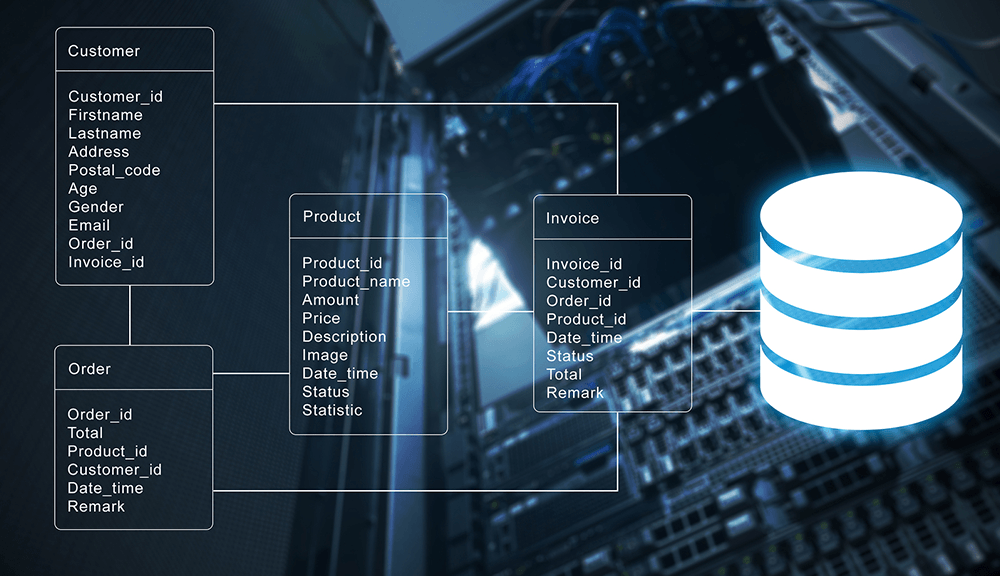

# Data Sources and Collection

> **With data collection, 'the sooner the better' is always the best answer — Marissa Mayer**

As a data scientist, you'll work with different types of data from different sources. It is important to understand not just these data sources but also how to collect the data therein. The process of data collection involves identifying the relevant data sources, collecting and extracting the data, and ensuring its quality and integrity. To achieve this, we'll be looking at 4 different data sources; _databases, APIs, web scraping_, and _data streams_.


### _What are data sources?_

<aside>

**_Definition..._**

_Data sources_ are locations where historic, live, static or real-time data originates from. These sources allow data to be stored, managed, and accessed while holding either raw or processed data. 

</aside>

> **Note**: Data sources can be diverse, including structured data from databases, spreadsheets, and APIs, as well as unstructured data from social media, text documents, and sensor devices.

As a data scientist, you need a good understanding of different data sources and collection techniques to gather the necessary information for analysis. However, collecting data requires careful planning, attention to detail, and basic knowledge of appropriate tools and techniques to ensure the data is accurate, complete, and representative of the problem being addressed. Owing to this, let's explore different data sources while simultaneously looking at how to collect data from these sources.

## 1. Databases
A database is an organized collection of structured information, or data, typically stored electronically in a computer system. Databases can store information about people, products, orders, transactions, or anything else using one or multiple tables. Each table is made up of rows and columns in a relational database, and records within each table is identified using a **primary key**. For example, the image below shows 4 tables; _Customer, Order, Product_, and _Invoice_. Each of this table has a primary key (Customer_id, Order_id, Product_id, Invoice_id) to  uniquely identifies each record.



As shown above, multiple tables are linked together for easy access and retrieval. All this is usually controlled by a database management system (DBMS), where data can then be easily accessed, managed, modified, updated, and organized using _Structured Query Language (SQL)_. An example SQL query to retrieve customers' record from a database is given below.

> **Note**: the table name and the retrieved data in the query below are imaginary

<code>

| Query                             | Description                                                    |
| --------------------------------- | -------------------------------------------------------------- |
| **SELECT * FROM CUSTOMER** | Retrieve all records or data from the customer table |

</code>

After running the query above, an example data that could be retrieved is given in the table below. It is evident that data are modelled into rows and columns where each row represent a customer information.


After data retrieval from databases, if required, you can store the retrieved data in a different format (such as `.csv`) or a separate location for further analysis or integration with other data sources. If you're curious to have better understand of SQL, check out the link below.

<details>

**<summary> Quick intro to SQL </summary>**

**<a href="https://sqlbolt.com" target="_blank"> Quick intro to practical SQL tutorial </a>**

</details>

## 2. Application Programming Interface (API)

<aside>

**Definition...**

API is a method of allowing two or more applications to talk to each other using an agreed protocol (or rule). This means one application would be able to access certain data or information from the other using a protocol.

</aside>

When we pull or check our phone for weather data, a request will be sent to your weather app which resides on a server that stores all the weather information. Behind the scene, an API is used to send a request to the weather app server, which sends back a response (i.e., weather information) to your phone through the API. As depicted below, an API serves as an intermediary that allows a data scientist to access data from public repositories or other sources. 

> 


For more detailed information about API, refer back to your previous <a href="https://web-app-development.vercel.app/lessons/apis.html" target="_blank"> `web application development` </a> course.
Now that we have an understanding of what API does, let us look at different format of data we can get while using an API. As a data scientist, the most common data format are `csv, json`, and `xml`. Below is a summary with example of how each of this data format looks like.

#### JSON
JSON is a `key-value` pair data format and has become one of the most popular format of sharing information in recent times. A file contain json data is saved using `.json` file extension. A sample json data about a pizza oder is given below

<code>

```
    {
        "crust"": "original",
        "toppings"": ["cheese","pepperoni"", "garlic""],
        "price"": "29.99",
        "shipping"": "delivery",
        "status"": "cooking"
    }
```

</code>

#### CSV
Comma Separated Value (CSV) is a popular data format in the data science communities, with a plain text file that uses specific structuring to arrange tabular data. It uses a comma (`,`) to separate each specific data value. A csv data is saved in a file with `.csv` extension. A sample csv data is given below. In this example, each row in the CSV file represents an employee's details, and each column represents a specific attribute of the employee. The first row is the header row, which provides the names of each attribute.

<code>

```
    EmployeeID,FirstName,LastName,Department,Position,Salary
    1,John,Doe,Marketing,Manager,50000
    2,Jane,Smith,Finance,Accountant,40000
    3,Michael,Johnson,IT,Developer,60000
    4,Sarah,Williams,HR,HR Manager,55000
    5,David,Brown,Sales,Sales Representative,45000
```

</code>
    
 Following the header row, each subsequent row contains the corresponding data for each employee. For example, the first employee has an EmployeeID of 1, a FirstName of John, a LastName of Doe, works in the Marketing department, holds the position of Manager, and has a salary of 50000.


#### Extensible Markup Language (XML)
XML is the data exchange format for API prior to JSON. It’s a markup language that’s both human and machine readable, and represent structured information such as documents, data, configuration, books, transactions, invoices, and much more. Data in xml format can be saved in a file with `.xml` extension. 

An example is given below showing data about a message from John to Bruce. This XML structure represents a basic representation of an email, including important details like sender, recipient, subject, body, and timestamp.

<code>

```
    <email>
    <sender>John</sender>
    <recipient>Bruce</recipient>
    <subject>Greetings</subject>
    <body>
        Dear Bruce,
        I hope this email finds you well. I wanted to reach out and say hello.
        Best regards,
        John
    </body>
    <timestamp>2023-05-15 09:30:00</timestamp>
    </email>
```

</code>

In this example, the `<email>` element represents the entire email structure. Inside the email, there are child elements such as `<sender>, <recipient>, <subject>, <body>, and <timestamp>`. The `<sender>` element contains the name of the sender, which is "John" in this case. The `<recipient>` element represents the recipient of the email, which is "Bruce". 

The `<subject>` element contains the subject of the email, which is "Greetings". The main content of the email is enclosed within the `<body>` element, and it contains the message text. The `<timestamp>` element represents the date and time when the email was sent, specified in a specific format, such as "2023-05-15 09:30:00".


## 3. Web Scraping
<aside>

**_Definition..._**

Web Scraping are different techniques used to automatically extract or `scrape` data from the web. These data can be unstructured or semi-structured, and most websites make their data publicly available to scrapers.

</aside>

> 📺 What is web scraping? listen to PyCoach! 👨🏾‍💻 

<div style="position: relative; padding-bottom: 56.25%; height: 0;"><iframe src="https://www.youtube.com/embed/dlj_QL-ENJM?start=21" title="Web Scrapping Intro" frameborder="0" allow="accelerometer; autoplay; clipboard-write; encrypted-media; gyroscope; picture-in-picture" allowfullscreen style="position: absolute; top: 0; left: 0; width: 100%; height: 100%; border: 2px solid grey;"></iframe></div>

While it is possible to scrape all kinds of web data from search engines and social media to government information, it doesn’t mean this data is always available. Depending on the website, you may need to employ a few tools and tricks to get exactly what you need, and also covert it into a format suitable for your project. In Python, we can use libraries like `BeautifulSoup` and `Scrappy` to scrape web pages. The process involves sending a request to a web page's URL, retrieving the HTML content of the page, and then parsing the HTML to extract the desired data. 

> **NOTE**: It's important to note that web scraping should be done ethically and responsibly, respecting the website's terms of service and not overloading their servers with excessive requests.

For example, if we want to scrape the prices of products, we can locate the HTML elements that contain the prices and use Python to extract and save them.

> 

Learning web scraping in Python can be empowering as it allows you to automate data collection from the vast amount of information available on the web, making it easier to analyze and make informed decisions based on that data.


## 4. Data Streams

<aside>

**_Definition..._**

**_Data streams_** Data streams refer to continuous sequences of data that are generated and received in real-time or near real-time from various sources such as sensors, social media feeds, financial markets, website clickstreams, and IoT devices.

</aside>

> 📺 What is _data streaming_? watch this video from Confluent! 👨🏾‍💻 

<div style="position: relative; padding-bottom: 56.25%; height: 0;"><iframe src="https://www.youtube.com/embed/Sgrks7ssGOA?start=1" title="Web Scrapping Intro" frameborder="0" allow="accelerometer; autoplay; clipboard-write; encrypted-media; gyroscope; picture-in-picture" allowfullscreen style="position: absolute; top: 0; left: 0; width: 100%; height: 100%; border: 2px solid grey;"></iframe></div>

In summary, remember the following about data streams...
- they are continuous sequences of data that are generated in real-time.
- they require specialized techniques and platforms for processing and analysis to derive insights and make informed decisions.
- Data scientists and analysts need specialized techniques to handle data streams effectively.
- it has numerous applications across industries, including real-time analytics, fraud detection, recommendation systems, and monitoring of network or infrastructure performance.
- organizations can gain valuable insights, respond quickly to emerging trends or events, and make data-driven decisions

> **👩🏾‍🎨 Practice: Describe JSON and XML Data... 🎯**

In this exercise, you'll access data from sample APIs using your browser. With this, you'll have hands-on experience on JSON and XML data. Try the following in your browser.
1. Open your browser
2. copy and paste each of the url below in your browser <br>
    
    - **[https://api.unibit.ai/v2/stock/historical/?tickers=AAPL&accessKey=demo](https://api.unibit.ai/v2/stock/historical/?tickers=AAPL&accessKey=demo)**
    - **[http://restapi.adequateshop.com/api/Traveler?page=1](http://restapi.adequateshop.com/api/Traveler?page=1)**

3. Describe what each data from the APIs is all about in the padlett below
    - **[https://padlet.com/curriculumpad/api-data](https://padlet.com/curriculumpad/draw-the-building-blocks-b1yn0aft11t9n4ox)**

<br>

> ➡️ In the next section, you'll be introduced to `data loading` and `data exploration` 🏙️.

