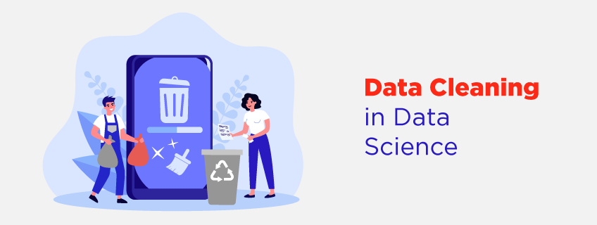

# Data Collection and Cleaning

**Welcome to week 2 of the Intro to data science course!** In the first week, we looked at data science broadly, including its building blocks and workflow, and and also understand data types, spreadsheets, python, and Google Colab. 

This week, we'll be more specific while looking at data collection and cleaning. First, we'll look at different data sources such as databases, APIs, web scraping, data streams. Next, we'll deep dive into data loading and exploration. Similarly, we'll touch on data cleaning and transformation. And finally, we'll look at data validation and privacy.

Whatever your prior expereince, this week you'll touch on basics of data collection and cleaning. You'll also continue practising how to learn and work together.

## Learning Outcomes

After this week, you will be able to:

- Explain and differentiate various data sources.
- Describe different data loading and cleaning techniques.
- Outline the importance of data quality.
- Compose documentation of relevant information about the analysis process.

### An overview of this week's lesson

<aside>

Watch the video below to get an overview of the this week.

</aside>

<iframe width="100%" height="415" src="https://www.youtube.com/embed/LAkuoH0A6Tk?si=mUs6dYq4UIqXWlG7" title="Linking your CSS" frameborder="0" allow="accelerometer; autoplay; clipboard-write; encrypted-media; gyroscope; picture-in-picture" allowfullscreen></iframe>

