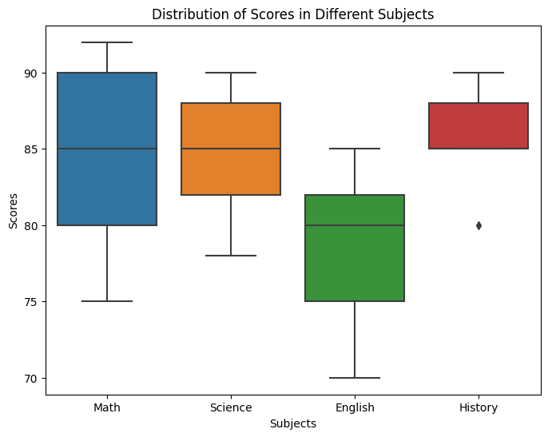

# Creating basic plots
As previously discussed, visualizing data is a powerful way to understand patterns, relationships, and distributions. Seaborn, a popular data visualization library in Python, offers a wide range of plot types that can help us gain insights from our data. In this lesson, we'll be looking at the following basic plots:

<aside>

1. Bar chart
2. Line plot
3. Box plot
4. Geographic map

</aside>


Now, let's explore these plot types by taking a closer look at how we can create them using Seaborn. Kindly note, we'll be using combination of Seaborn and Matplotlib in this lesson.


### 1. Bar Chart
A bar plot is useful for comparing categories or groups and displaying their corresponding values. It allows us to visualize the distribution or relationship between categorical variables. Seaborn's `barplot()` function can be used to create bar plots. 

Let's consider an imaginary dataset of students' scores in different subjects. We'll create a bar plot using Seaborn to visualize the scores. First, we created a _DataFrame_ with the subjects and scores, and then use Seaborn's barplot function to create a bar plot.

```python
import seaborn as sns
import matplotlib.pyplot as plt

# Imaginary data
subjects = ['Math', 'Science', 'English', 'History']
scores = [85, 90, 75, 80]

# Create a DataFrame with subjects and scores
data = {'Subjects': subjects, 'Scores': scores}
df = pd.DataFrame(data)

# Create a bar plot using Seaborn
plt.figure(figsize=(8, 6))
sns.barplot(data=df, x='Subjects', y='Scores')
plt.title('Student Scores in Different Subjects')
plt.xlabel('Subjects')
plt.ylabel('Scores')
plt.show()
```


In the above bar chart, the x-axis represents the subjects, while the y-axis represents the scores. Each bar represents the score achieved in a particular subject. This way, the bar plot allows us to visually compare the scores of the students in different subjects, and provides an overview of their performance.

### 2. Line Plot
A line plot is used to display the trend or change in a variable over time or another continuous dimension. Seaborn's lineplot function can be used to create line plots. 

Let's consider an imaginary dataset of a student's scores, where we have a list of dates and the corresponding scores achieved by a student over time. We can create a DataFrame with the dates and scores, and then convert the `Date` column to datetime format using `pd.to_datetime`. Here is an example of using `lineplot()`to visualize the score progression:

```python
import seaborn as sns
import matplotlib.pyplot as plt
import pandas as pd

# Imaginary data
dates = ['2022-01-01', '2022-02-01', '2022-03-01', '2022-04-01', '2022-05-01']
scores = [85, 90, 80, 95, 88]

# Create a DataFrame with dates and scores
data = {'Date': dates, 'Score': scores}
df = pd.DataFrame(data)

# Convert the 'Date' column to datetime format
df['Date'] = pd.to_datetime(df['Date'])

# Create a line plot using Seaborn
plt.figure(figsize=(15, 6))
sns.lineplot(data=df, x='Date', y='Score')
plt.title('Student Score Progression Over Time')
plt.xlabel('Date')
plt.ylabel('Score')
plt.show()
```


With these, we can observe the trend and changes in the student's performance over time.


### 3. Box Plot:
A box plot is used to display the distribution of numerical data and identify outliers. It provides information about the median, quartiles, and potential outliers in the data. Seaborn's boxplot function can be used to create box plots. Here's an example:

Let's consider an imaginary dataset of students' scores in different subjects. We'll create a box plot using Seaborn to visualize the distribution of scores.

```python
import seaborn as sns
import matplotlib.pyplot as plt

# Imaginary data
math_scores    = [85, 90, 75, 80, 92]
science_scores = [78, 85, 88, 82, 90]
english_scores = [70, 80, 75, 85, 82]
history_scores = [80, 85, 88, 90, 85]

# Create a DataFrame with subjects and scores
data = {'Math': math_scores, 'Science': science_scores, 'English': english_scores, 'History': history_scores}
df = pd.DataFrame(data)

# Create a box plot using Seaborn
plt.figure(figsize=(8, 6))
sns.boxplot(data=df)
plt.title('Distribution of Scores in Different Subjects')
plt.xlabel('Subjects')
plt.ylabel('Scores')
plt.show()
```



In this example, we created a DataFrame with the subjects and scores, and then use Seaborn's boxplot function to create a box plot. The box plot displays the distribution of scores for each subject, by visually comparing the distributions of scores across different subjects and identifying any variations in performance.

<!-- ### 5. Heatmap
A heatmap is used to represent data in a matrix format, where the values are color-coded. It is particularly useful for visualizing relationships or patterns in a dataset. Seaborn's heatmap function can be used to create heatmaps. Here's an example:

```python
import seaborn as sns

# Load the data
data = sns.load_dataset('flights')
data = data.pivot('month', 'year', 'passengers')

# Create a heatmap
sns.heatmap(data, cmap='coolwarm', annot=True, fmt='d')

# Display the plot
sns.plt.show()
``` -->

### 4. Geographic Map
Seaborn, in combination with other libraries, can be used to create geographic maps. These maps help visualize data spatially, such as plotting data points on a world map. To create a geographic map using Seaborn, we can utilize the `geopandas` library to handle the map data and then use Seaborn to visualize it. 

Let's consider an example where we want to plot selected countries across the world on a world map.

```python
import geopandas as gpd
import matplotlib.pyplot as plt

# Load the world map data
world = gpd.read_file(gpd.datasets.get_path('naturalearth_lowres'))

# Select the countries in Europe and Africa
selected_countries = ['United States', 'Canada', 'China', 'India', 'Pakistan', 
                        'Saudi Arabia', 'United Kingdom', 'Russia', 'Denmark', 
                        'Brazil', 'Nigeria', 'Kenya', 'South Africa', 'Ghana', 
                        'Algeria', 'Egypt'
                    ]
filtered_map = world[world['name'].isin(selected_countries)]

# Plot the selected countries on the map
fig, ax = plt.subplots(figsize=(12, 8))
world.plot(ax=ax, color='lightgray')
filtered_map.plot(ax=ax, color='blue')
plt.title('Selected Countries in Europe and Africa')
plt.show()
```


### 👩🏾‍🎨 Practice: Plot your data... 🎯


 <br><br>

> ➡️ Next, you'll learn data distribution using `histograms` and `density plots` 🎯.