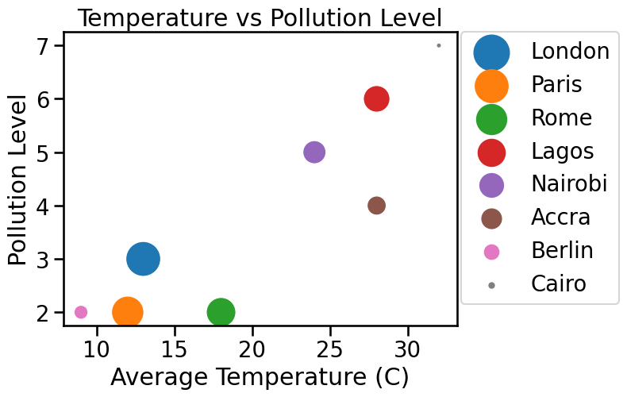
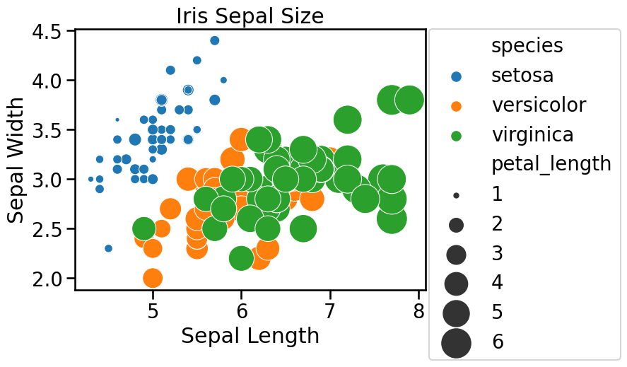

# Data size and Bubble chart

**_Data size_** refers to the amount of data we have to work with. It can vary from small datasets with just a few rows and columns to massive datasets with millions or even billions of data points. The size of the data is important because it can affect how we analyze and visualize the information it contains. To represent different components (such as high and low values) in our visualization, we can use a 3D visualization such as `Bubble chart`.


## Bubble chart

<aside>

**_Definition..._**

**Bubble chart** is a type of data visualization that helps us represent three dimensions of data in a two-dimensional plot. It is similar to a scatter plot, _but with an additional dimension represented by the size of the bubbles_. 

</aside>

<div style="position: relative; padding-bottom: 56.25%; height: 0;"><iframe src="https://www.youtube.com/embed/Fygi3mQY0Ag" title="Web Scrapping Intro" frameborder="0" allow="accelerometer; autoplay; clipboard-write; encrypted-media; gyroscope; picture-in-picture" allowfullscreen style="position: absolute; top: 0; left: 0; width: 100%; height: 100%; border: 2px solid grey;"></iframe></div>


To understand this better, let's consider some examples...

#### Example 1
Let's consider an imaginary dataset that contains pollution information about different cities from Europe (London, Paris, Berlin, and Rome) and Africa (Lagos, Cairo, Nairobi, and Accra). The dataset includes information on the population size, average temperature in Celsius, and pollution level for each city. We can create the bubble chart by following these steps:

1. import the libraries
2. create the dataset
3. create the bubble chart

Programatically, we can achieve the above steps using the code snippet below.

```python
import pandas as pd
import seaborn as sns
import matplotlib.pyplot as plt

# Create an imaginary dataset
data = pd.DataFrame({
    'City': ['London', 'Paris', 'Rome', 'Lagos', 'Nairobi', 'Accra', 'Berlin', 'Cairo'],
    'Population': [8900000, 2141000, 2873000, 21000000, 4397000, 2062000, 3645000, 20340000],
    'Average Temperature (C)': [13, 12, 18, 28, 24, 28, 9, 32],
    'Pollution Level': [3, 2, 2, 6, 5, 4, 2, 7]
})

# Create a bubble chart
sns.scatterplot(data=data, x='Average Temperature (C)', y='Pollution Level', size='City', hue='City', sizes=(20, 1000))

# Add labels and title
plt.xlabel('Average Temperature (C)')
plt.ylabel('Pollution Level')
plt.title('Temperature vs Pollution Level')

# move legend outside the chart
plt.legend(bbox_to_anchor=(1.01, 1),borderaxespad=0)

# Show the plot
plt.show()
```



The above bubble chart shows the relationship between average temperature and pollution level, with the size of each bubble representing the population size of the city.

#### Example 2
In this example, we'll use a real-life dataset - the famous `iris` dataset, which contains measurements of sepal length, sepal width, petal length, and petal width for different iris flowers. We can create the bubble chart by following these steps:
1. import the libraries
2. load the dataset
3. create the bubble chart

Programatically, we can achieve the above steps using the code snippet below.

```python
import seaborn as sns
import matplotlib.pyplot as plt

# Load the iris dataset from seaborn
iris = sns.load_dataset('iris')

# Create a bubble chart
sns.scatterplot(data=iris, x='sepal_length', y='sepal_width', size='petal_length', sizes=(20, 1000), hue='species')

# Add labels and title
plt.xlabel('Sepal Length')
plt.ylabel('Sepal Width')
plt.title('Iris Sepal Size')

# move legend outside the chart
plt.legend(bbox_to_anchor=(1.01, 1),borderaxespad=0)

# Show the plot
plt.show()
```



This bubble chart shows the relationship between sepal length and sepal width, with the size of each bubble representing the petal length. This can help us understand the distribution of iris flowers based on their sepal size and petal length.


<aside>

**_In summary..._**

_Bubble charts_ are useful when we want to compare multiple variables simultaneously and understand their relationships in a single visualization. They provide a visually appealing and intuitive way to explore data and identify patterns or trends.

</aside>


### 👩🏾‍🎨 Practice: Know your Diamonds... 🎯

We'll continue to use the "diamonds" dataset available in Seaborn. Can we visualize the relationship between the carat weight, price, and clarity of diamonds using a bubble chart?

**Task**: create a bubble chart to visualize the relationship between the `carat weight`, `price`, and `clarity of diamonds`.

**Instructions**:

- Import the necessary libraries, including `Seaborn` and `Matplotlib`.
- Load the `diamonds` dataset from Seaborn.
- Create a bubble chart with `carat` on the _x-axis_, `price` on the _y-axis_, and use `clarity` to determine the size of the bubbles.
- Bonus (Optional):
    - Label the axes and add a title to the bubble chart.
    - Use different colors to represent different clarity levels.

**Dataset**:
You can load the `diamonds` dataset directly from Seaborn.

 <br><br>

> ➡️ Next, you'll learn data distribution using `histograms` and `density plots` 🎯.

