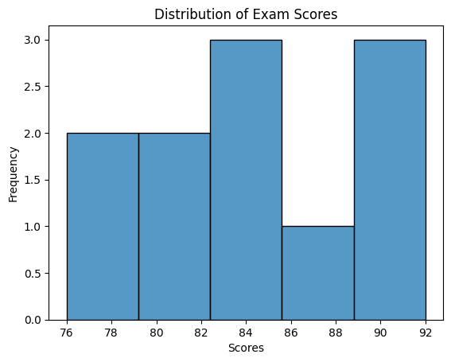
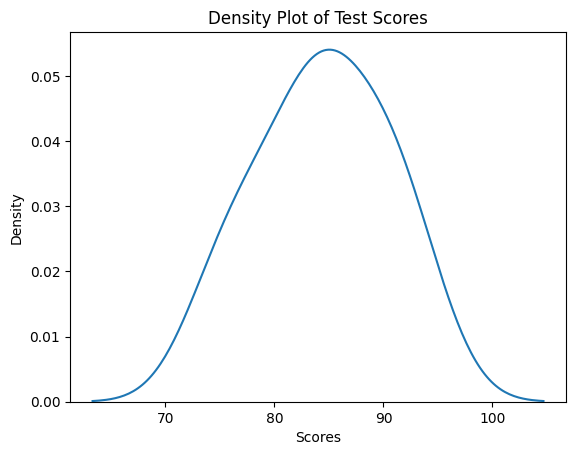
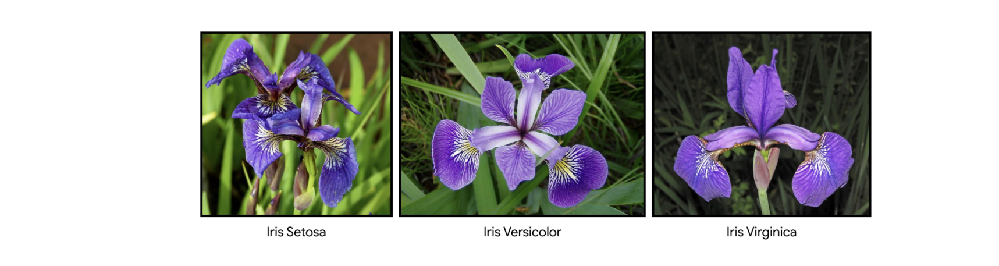
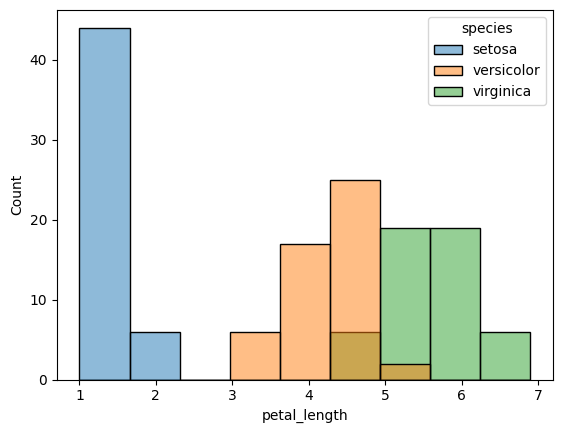
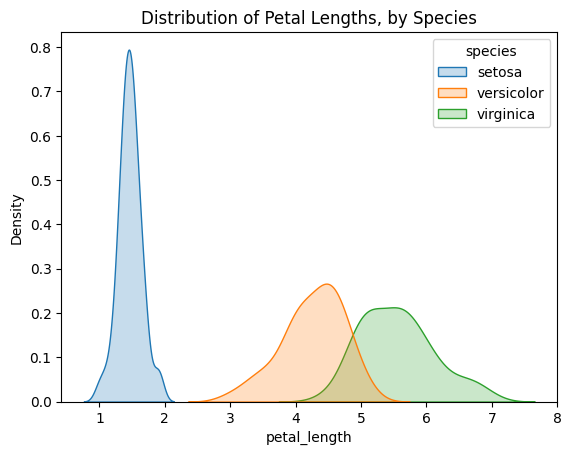

# Data Distribution
Imagine you have a dataset containing the ages of a group of people. Then, you want to understand how the ages are distributed, which means you want to see how many people fall into different age ranges. This is what data distribution is about, and `histograms` and  `density plots` are useful visualizations for this purpose.


### 1. Histogram
A histogram is used to visualize the distribution of a continuous variable by displaying the frequency or count of observations falling within specific intervals or bins. A histogram is like a bar graph that shows the frequency or count of scores falling within specific score ranges, known as `bins`. Each bar in the histogram represents a bin, and its height indicates the number of students with scores within that range. 

For example, if the histogram shows a tall bar around the 70-80 range, it means many students scored within that range. A histogram helps visualize the overall pattern and spread of the scores, allowing you to identify common score ranges or any outliers. Seaborn's `histplot()` function can be used to create histograms.

Suppose we have data on the exam scores of a class of students. A histogram helps us understand the distribution of scores. For example

```python
import seaborn as sns

# Assuming you have a list of test scores called 'scores'
scores = [78, 85, 90, 74, 92, 85, 76, 88, 80, 90, 85, 82, 94, 83]

# Create a histogram
sns.histplot(scores, bins=8)
plt.title('Distribution of Test Scores')
plt.xlabel('Scores')
plt.ylabel('Frequency')
plt.show()
```



In the code above, we use the `sns.histplot` function to create a histogram and specify the number of bins (ranges) to divide the scores into.

### 2. Density plots
A density plot, on the other hand, is a smooth line that shows the distribution of data as a continuous curve. Instead of using bins like a histogram, a density plot estimates the probability density function of the data. 

It gives you an idea of how likely it is to find a data point within a certain range. In our age example, the density plot would show the likelihood of finding a person of a specific age. It can help you understand the overall shape of the distribution, such as whether it's symmetric, skewed to the right or left, or multi-modal (having multiple peaks). For example:

```python
import seaborn as sns

# Assuming you have a list of test scores called 'scores'
scores = [78, 85, 90, 74, 92, 85, 76, 88, 80, 90, 85, 82, 94, 83]

# Create a density plot
sns.kdeplot(scores)
plt.title('Density Plot of Test Scores')
plt.xlabel('Scores')
plt.ylabel('Density')
plt.show()
```



We use the `sns.kdeplot` function, which stands for kernel density estimation. This function estimates the underlying probability density function of the scores and visualizes it as a smooth curve. 

Now that we have an idea of data distribution using histogram and density plot, let's apply these distrubtion techniques on a real-life dataset. 

## Distribution of IRIS dataset
The Iris dataset is a well-known dataset in the field of data science and machine learning. It consists of measurements of different attributes of various iris flowers - `setosa, versicolor`, and `virginica`. 



To put it simply, imagine a dataset that contains information about different types of flowers called irises. For each iris flower, the dataset provides four main measurements:

1. **Sepal Length**: This is the length of the outer part of the flower known as the sepal. Think of it as the green protective cover around the flower.

2. **Sepal Width**: This is the width of the sepal, measured from one side to the other.

3. **Petal Length**: This is the length of the inner colorful part of the flower known as the petal. It's the part that often comes in various colors like purple, white, or yellow.

4. **Petal Width**: This is the width of the petal, measured from one side to the other.

By studying these measurements for a variety of iris flowers, we can gain insights into the different types of iris flowers and understand how they vary from one another. This dataset is often used in data science and machine learning to practice analyzing data and build predictive models.

### Histogram and density plot of IRIS
One of the benefit of using Seaborn is the in-built dataset that comes with it. One of this dataset is the Iris dataset we'll be using in this exercise. To load the dataset and view the top rows using Seaborn, we can use the code snippet below:

```python
# load iris dataset
iris_dataset = sns.load_dataset("iris")

# show top 5 rows
iris_dataset.head()
```

|index|sepal\_length|sepal\_width|petal\_length|petal\_width|species|
|---|---|---|---|---|---|
|0|5\.1|3\.5|1\.4|0\.2|setosa|
|1|4\.9|3\.0|1\.4|0\.2|setosa|
|2|4\.7|3\.2|1\.3|0\.2|setosa|
|3|4\.6|3\.1|1\.5|0\.2|setosa|
|4|5\.0|3\.6|1\.4|0\.2|setosa|

Next, let's create a distribution of the Iris species by grouping each specie using colour-coded histogram. We can add colour to the bars of a histogram using the `hue` property of the `histplot()` function.

```python

# create a colour-coded distribution of each flower
histogram = sns.histplot(data=iris_dataset, x='petal_length', hue='species')

```



Next, let's create a density plot of the petal length for each specie.

```python
# Density plots for each species
sns.kdeplot(data=iris_data, x='Petal Length (cm)', hue='Species', shade=True)

# Add title
plt.title("Distribution of Petal Lengths, by Species")
```



An interesting pattern we can see in the plots is that the species seem to belong to one of two groups- `versicolor` and `virginica` seem to have similar values for petal length, while `setosa` belongs in a category all by itself. In fact, if the petal length of an iris flower is less than 2 cm, it's most likely to be _setosa_!

<aside>

**_In summary..._**

Both histograms and density plots help you grasp the distribution of data and provide insights into how data point are spread across different ranges. They allow you to identify patterns, central tendencies, and any unusual observations in the dataset.

</aside>


### 👩🏾‍🎨 Practice: Data distribution... 🎯

<!-- In this lesson, we've seen how to read data from CSV and API, and how to get a view of our data using `head()` function. Now you need to explore other Pandas functions.
1. Using the DataFrame you loaded from the CSV, what type of information do you get when you use `describe()` and `tail()` function?
2. Share your answer using the padlet below.
    
    **[https://padlet.com/curriculumpad/draw-the-building-blocks-b1yn0aft11t9n4ox](https://padlet.com/curriculumpad/draw-the-building-blocks-b1yn0aft11t9n4ox)** -->

 <br><br>

> ➡️ In the next section, you'll learn how to derive insight from data 🎯.