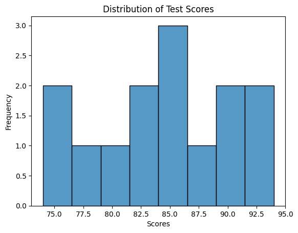

# Data distribution


### 1. Histogram
A histogram is used to visualize the distribution of a continuous variable. It displays the frequency or count of observations falling within specific intervals or bins. Seaborn's `histplot()` function can be used to create histograms.

Suppose we have data on the exam scores of a class of students. A histogram helps us understand the distribution of scores. Now, let's use Seaborn's `histplot()` function to create this plot.

```python
import seaborn as sns
import matplotlib.pyplot as plt

# Imaginary data
scores = [78, 85, 90, 92, 85, 76, 88, 80, 90, 85, 82]

# Create a histogram
sns.histplot(scores)
plt.xlabel('Scores')
plt.ylabel('Frequency')
plt.title('Distribution of Exam Scores')
plt.show()
```

