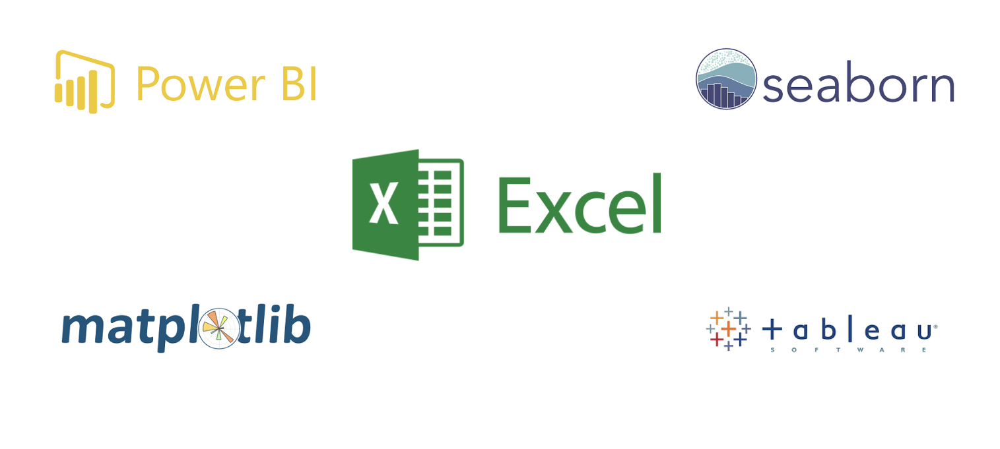

# Visualization Tools and Libraries 📶
In week 1, we looked at data visualization using Excel. In this lesson, we'll dive a little deeper into different and popular visualization `tools` and `libraries`. These tools and libraries are important for our daily analysis as it offers wide variety of ways to present our data. Hence, this lesson aims to introduce you to some of these awesome tools.

## Visualization tools

<aside>

**_Definition...✍🏾_**

**_Data visualization_** tools are software or platforms that helps in representing data in visual formats such as charts, graphs, and maps. 

</aside>

Visualization tools make it possible to create charts, graphs, maps, and other visual representations of data, allowing us to uncover patterns, trends, and insights that may not be apparent from raw numbers or text. However, there are various data visualization tools available, each with its own unique features and capabilities. Let's take a quick look at some of these tools.

### 1. Power BI

<aside>

**_Definition..._**

**_Power BI_** is a user-friendly and powerful data visualization tool that allows you to transform raw data into interactive and visually appealing reports and dashboards. It is designed to help you analyze and present data in a way that is easy to understand and enables data-driven decision-making.

</aside>

<iframe src="https://www.youtube.com/embed/PXqFXG4rzXE" title="Web Scrapping Intro" frameborder="0" allow="accelerometer; autoplay; clipboard-write; encrypted-media; gyroscope; picture-in-picture" allowfullscreen style="position: absolute; top: 0; left: 0; width: 100%; height: 100%; border: 2px solid grey;"></iframe>

In summary, Power BI allows you to...
- Connect to various data sources, including Excel spreadsheets, databases, and APIs.
- Retrieve and combine data from different sources within Power BI.
- Create visualizations such as charts, tables, and maps using a drag-and-drop interface.
- No coding is required to build visualizations in Power BI.
- Customize visualizations according to your preferences.
- Explore and interact with data through interactive features provided by Power BI.
- Power BI offers a wide range of visualization options.
- Create visually appealing and interactive charts, tables, and maps.

To futher explore Power BI, you can download it using the link below.

<strong>

  
Download Power BI for desktop!

  **[https://powerbi.microsoft.com/en-us/desktop/](https://powerbi.microsoft.com/en-us/desktop/)**

</strong>

### 2. Tableau

<aside>

**_Definition..._**

**_Tableau_** is a popular data visualization tool that allows novice data scientists to easily create interactive and visually compelling visualizations from raw data. It provides a user-friendly interface that enables users to explore and analyze data without the need for extensive programming skills.

</aside>

<iframe src="https://www.youtube.com/embed/6xv1KvCMF1Q" title="Web Scrapping Intro" frameborder="0" allow="accelerometer; autoplay; clipboard-write; encrypted-media; gyroscope; picture-in-picture" allowfullscreen style="position: absolute; top: 0; left: 0; width: 100%; height: 100%; border: 2px solid grey;"></iframe>

In summary... 
- Tableau is a beginner-friendly data visualization tool
- It empowers novice and expert data scientists to explore, analyze, and communicate data through interactive and visually appealing visualizations. 
- It provides a user-friendly interface, a wide range of visualization options, and ample learning resources to support your journey in data visualization and analysis.
- It provides the ability to create dynamic dashboards, making it an ideal choice for data analysis and communication.

To futher explore Tableau, you can download it using the link below.

<strong>

  
 Download Tableau for student 

  **[https://www.tableau.com/en-gb/academic/students](https://www.tableau.com/en-gb/academic/students)**

</strong>

### 3. Matplotlib

<aside>

**_Definition..._** 

**_Matplotlib_** is a data visualization library in Python that helps us create various types of static and interactive visualizations. It is widely used in data science and provides a flexible and customizable way to visualize data.

</aside>

<iframe src="https://www.youtube.com/embed/qqwf4Vuj8oM?si=BwJ0cxEBVvvXOiEJ" title="Web Scrapping Intro" frameborder="0" allow="accelerometer; autoplay; clipboard-write; encrypted-media; gyroscope; picture-in-picture" allowfullscreen style="position: absolute; top: 0; left: 0; width: 100%; height: 100%; border: 2px solid grey;"></iframe>

While Power BI and Tableau are powerful tools for data visualization, there are a few reasons why one might choose Matplotlib over them:

1. **Flexibility and Customization**: Matplotlib allows you to have complete control over the design and appearance of your visualizations. It provides a wide range of customization options, allowing you to tweak every aspect of your plots to suit specific needs.

2. **Python Integration**: Matplotlib is built within the Python ecosystem and seamlessly integrates with other popular libraries such as NumPy and Pandas. This allows you to perform data analysis and visualization within a single Python environment, streamlining the workflow.

3. **Code-based Approach**: Matplotlib is a code-based library, meaning that visualizations are created by writing Python code. This provides greater flexibility in terms of automating repetitive tasks, creating complex visualizations, and incorporating them into larger data analysis workflows.

For example, let's say we have a dataset containing monthly sales data for a retail store. We want to create a line plot showing the trend in sales over time. Using Matplotlib, we can write a few lines of code to load the data, extract the necessary information, and create the plot. We can customize the axes labels, add a title, and even save the plot to a file, all using code. This flexibility and control allow us to create visualizations tailored to our specific requirements.

<aside>

**Note**: It's important to note that Power BI and Tableau have their own strengths, especially when it comes to creating interactive and dynamic dashboards, handling large datasets, and sharing visualizations with a broader audience. Hence, the choice of tool ultimately depends on the specific needs, goals, and your skill set.

</aside>

### 4. Seaborn

<aside>

**_Definition..._**

**Seaborn** is a Python data visualization library that makes it easier to create visually appealing and informative statistical graphics. It provides a high-level interface and a set of predefined themes and color palettes that enhance the aesthetics of your visualizations.

</aside>

<iframe src="https://www.youtube.com/embed/vaf4ir8eT38" title="Web Scrapping Intro" frameborder="0" allow="accelerometer; autoplay; clipboard-write; encrypted-media; gyroscope; picture-in-picture" allowfullscreen style="position: absolute; top: 0; left: 0; width: 100%; height: 100%; border: 2px solid grey;"></iframe>

In summary...
- Seaborn is a library for data visualization that offers more functionality than Matplotlib.
- Seaborn has built-in datasets, such as the penguins dataset, which contains information about penguins' characteristics.
- One-variable plots in Seaborn can be created for continuous values using histogram-like plots called "displots."
- Categorical columns can be visualized using Seaborn's `countplot` to display the count of each category.
- Seaborn's `displot` can also be used to visualize the distribution of a continuous variable by different categories using the "hue" parameter. Additionally, the plot can be smoothed using the "kde" parameter.

## Further reading
The tools we have covered so far are just a few examples of data visualization tools available in the market. Each tool has its own strengths and caters to different needs and skill levels. However, it's important to choose the right tool based on the data requirements, visualization goals, and your preferences. Further reading on these tools and their specific features can be found in their respective documentation and online resources below.

- [Power BI](https://learn.microsoft.com/en-us/power-bi/)
- [Tableau](https://www.tableau.com/en-gb/academic/students)
- [Matplotlib](https://matplotlib.org/stable/index.html)
- [Seaborn](https://seaborn.pydata.org/)

   

> ➡️ In the next section, you'll learn how to create basic `charts` and `graphs` 🎯.

