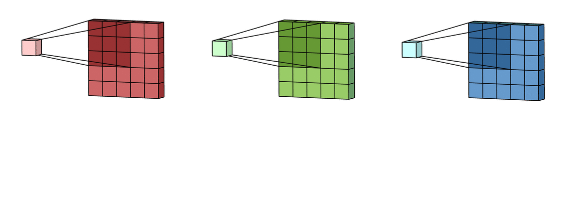
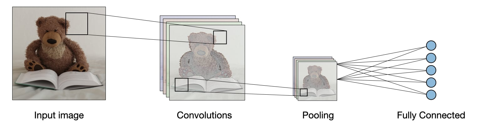

# Computer Vision
A great application of deep learning in recent times is computer vision. Have you ever imagine yourself in a self driving car? Imagine you're sitting in a self-driving car as it approaches a pedestrian crossing at an intersection. Computer vision is like the car's super-smart eyes that help it understand everything happening around it.

The car's cameras capture images of the road, the traffic lights, and the people walking on the pedestrian crossing. These images are then processed by the computer inside the car. Computer vision algorithms look at these pictures and figure out important things: where the road is, whether the traffic light is red or green, and most importantly, if there are people about to cross the road.

Computer vision helps computer **see** the world like humans. It's not just about looking at pictures – it's about the computer's brain understanding what those pictures mean and making the right decisions. So, when the car detects people on the pedestrian crossing, it knows it needs to slow down and stop, ensuring everyone's safety.

<aside>

**_Definition..._**

**_Computer vision_**  is a field of AI that gives computers the ability to *see* things like humans. It is used to process and analyze digital images and videos to extract meaningful information.
</aside>

<iframe width="100%" height="415" src="https://www.youtube.com/embed/OcycT1Jwsns" title="Computer Vision" frameborder="0" allow="accelerometer; autoplay; clipboard-write; encrypted-media; gyroscope; picture-in-picture" allowfullscreen></iframe>

<b> Further reading - computer vision </b>

<iframe width="100%" height="415" src="https://www.youtube.com/embed/-4E2-0sxVUM" title="Computer Vision" frameborder="0" allow="accelerometer; autoplay; clipboard-write; encrypted-media; gyroscope; picture-in-picture" allowfullscreen></iframe>

At the core of computer vision is a popular deep learning algorithm known as *Convolutional Neural Network* (CNN). Let's think of a CNN as a special kind of brain that computers use to understand pictures, just like we do. CNN breaks down pictures into tiny important parts called `features`. 

It does this by sliding a small window (or _filter_), like a magnifying glass looking for features, over the picture. This _filter_ checks for patterns in different parts of the image. This process of extracting relevant features from the image is called `convolutions`. And the result of convolutions is a subset of the original input image called `feature maps`. 

After detecting patterns, CNN often uses `pooling` layers to shrink the image's size while keeping the important information. This helps reduce the complexity of the data and focuses on the essential features. 

Subsequently, the CNN flattens the feature maps into a 1D vector and feeds them into a _`fully connected`_ neural network. This part combines all the patterns found so far to make decisions, just like putting together all the pieces of a puzzle.

<b> Further reading - CNN </b>

<iframe width="100%" height="415" src="https://www.youtube.com/embed/QzY57FaENXg" title="Computer Vision" frameborder="0" allow="accelerometer; autoplay; clipboard-write; encrypted-media; gyroscope; picture-in-picture" allowfullscreen></iframe>

## Computer vision tasks
*Classification*, *Detection*, and *Segmentation* are three different tasks that can be performed on images. There choice depends on the type of problem we are trying to solve. Let's take a closer look at what each task means for the computer.

### Classification
Imagine you have a picture of a pet, and you want the computer to tell you if it's a cat or a dog. Classification would involve showing the computer this picture and having it say `This is a cat` or `This is a dog`. So, if you show the computer a picture of a cat, it will recognize it as a cat. This task is used when you want to answer questions like `What is this?` or `Is this object present?`

### Detection
Now, let's say you have a picture with multiple pets, including both cats and dogs. Detection comes into play when you want the computer to locate and outline each cat and dog in the picture. It would draw boxes around the cats and dogs to show where they are in the image. Detection helps answer questions like `Where are the objects in this image?`

### Segmentation
Segmentation goes further by coloring or labeling every single pixel in the image according to the object it belongs to. In our example, if you show the computer an image with a cat and a dog, it would not only locate them but also color all the pixels of the cat differently from those of the dog. This gives you a detailed breakdown of which pixels are part of which object. This task is used when you need to know `What parts of the image belong to which objects?`.

 

<iframe width="100%" height="415" src="https://www.youtube.com/embed/taC5pMCm70U" title="Computer Vision" frameborder="0" allow="accelerometer; autoplay; clipboard-write; encrypted-media; gyroscope; picture-in-picture" allowfullscreen></iframe>

<b> Further reading - ImageNet </b>

<iframe width="100%" height="415" src="https://www.youtube.com/embed/SfqN-Hc5two" title="Computer Vision" frameborder="0" allow="accelerometer; autoplay; clipboard-write; encrypted-media; gyroscope; picture-in-picture" allowfullscreen></iframe>

Classification, detection, and segmentation are all important tasks in computer vision. They can be used to solve a wide variety of problems, such as:

- Self-driving cars
- Virtual reality
- Medical imaging
- Industrial automation

<aside>

**_Lesson summary..._**

**_Computer vision_** is a field of AI that gives computers the ability to *see* things like humans. It is used to process and analyze digital images and videos to extract meaningful information. 

At the core of computer vision is a popular deep learning algorithm known as *Convolutional Neural Network* (CNN). Let's think of a CNN as a special kind of brain that computers use to understand pictures, just like we do.

There are 3 different computer vision tasks that can be performed on images and videos.
- Classification
- Detection
- Segmentation
</aside>

### 👩🏾‍🎨 Practice: Computer vision... 🎯

 

> ➡️ Next, we'll look at `How to build a classification model`... 🎯