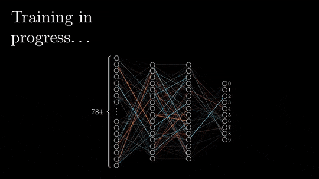

# Intro to Deep Learning 
Imagine you're teaching a robot to recognize different types of numbers. You show the robot lots of pictures of these numbers and tell it which one is which. As the robot sees more pictures, it learns to identify the numbers on its own. That's kind of like how deep learning works!

Deep learning is a type of artificial intelligence where computers learn from examples, just like you teach your pet new tricks. Instead of giving the computer a list of rules, you show it a bunch of examples and let it figure things out by itself. 

Deep learning has been used to achieve state-of-the-art results in a wide variety of tasks, including:

- **Image recognition**: Identifing objects in images such as classifying images of `cats` and `dogs`.
- **Natural language processing**: To understand and process natural language. For example, to translate languages, answer questions, and summarize text like `ChatGPT`.
- **Speech recognition**: To recognize speech such as transcribing audio recordings into text.
- **Machine translation**: To translate text from one language to another such as translating English text into _Swahili_.
- **Medical diagnosis**: To diagnose medical conditions such as identifying cancer cells in images.

These are just few of its applications since deep learning is a rapidly growing field, and new applications are being developed all the time. As the technology continues to improve, it is likely that deep learning will become even more widely used in the years to come. At the backbone of DL is `neural networks` which is used to do all the gymnastics behind the scene.

## Neural networks

<aside>

**_Definition..._**

**_Neural networks_** is a type of ML model that is inspired by the human brain. It is made up of a network of nodes, called neurons, that are connected to each other. The neurons in a neural network work together to learn from data and make predictions..
</aside>

<iframe width="100%" height="415" src="https://www.youtube.com/embed/aircAruvnKk" title="Linking your CSS" frameborder="0" allow="accelerometer; autoplay; clipboard-write; encrypted-media; gyroscope; picture-in-picture" allowfullscreen></iframe>

While training a neural network, the input data is passed through a neural network from the input layer to the output layer. The input data is multiplied by the `weights` of the neurons in the input layer. The results are then passed to the next layer, where they are multiplied by the `weights` of the neurons in that layer. 

This process continues until the data reaches the output layer, and it is referred to as `forward propagation`. Once the data has reached the output layer, it is passed through the activation function of the output layer. The result is the output of the neural network.

At each layer, the data is also passed through an activation function. The activation function determines how the data is processed by the neurons in that layer. The neural network is then updated using `backpropagation`. 

**Backpropagation** is the process of calculating the errors in the output layer and then propagating these errors back through the neural network to the input layer. The weights of the neurons are then adjusted to minimize the errors.

This process is repeated until the neural network converges, meaning that it has learned to represent the data as accurately as possible.

## Machine learning vs Deep learning
Machine learning and deep learning are related concepts, but they have some differences. Machine learning and deep learning are both types of AI that allow computers to learn without being explicitly programmed. However, there are some key differences between the two.

 

To understand this difference, imagine you have a friend who wants to learn how to identify different types of fruits, like apples, oranges, and bananas, and you want to use both ML and DL to solve this problem.

- **Machine Learning**: You decide to show your friend pictures of these fruits and telling them which one is which. Machine learning is like teaching your friend to recognize fruits by giving them some general rules to follow. They learn from the examples you give them, and then they can identify new fruits they haven't seen before
- **Deep learning**: Now assume you have another friend who wants to learn about fruits, but they want to go a step further to understand the fine details and even the textures of each fruit. Deep learning is like teaching your second friend to recognize fruits by giving them a lot more data and allowing them to learn many intricate details using complex algorithms and techniques to understand not just the general rules, but also the specific features that make each fruit unique.

In essence, machine learning is about teaching computers to learn from examples using general rules, while deep learning is a more advanced version that dives deep into the intricate details to make even more accurate predictions and classifications.

<iframe width="100%" height="415" src="https://www.youtube.com/embed/q6kJ71tEYqM" title="Linking your CSS" frameborder="0" allow="accelerometer; autoplay; clipboard-write; encrypted-media; gyroscope; picture-in-picture" allowfullscreen></iframe>

<!--  -->

In general, ML and DL are different based on some features. Some of these features are highlighted in the table below.

| Feature           | Machine learning                                                                | Deep learning                                                                           |
| ----------------- | ------------------------------------------------------------------------------- | --------------------------------------------------------------------------------------- |
| **Definition**        | A type of AI that allows computers to learn without being explicitly programmed | A subset of machine learning that uses artificial neural networks to learn from data    |
| **Algorithms**        | Linear regression, logistic regression, decision trees, support vector machines | Artificial neural networks, Convolutional neural networks                                                              |
| **Complexity**        | Less complex                                                                    | More complex                                                                            |
| **Data requirements** | Less data required                                                              | More data required                                                                      |
| **Accuracy**          | Can be accurate, but not as accurate as deep learning                           | Can be very accurate, especially for complex tasks                                      |
| **Applications**      | Spam filtering, fraud detection, image classification, text classification      | Natural language processing, speech recognition, machine translation, medical diagnosis |

<aside>

**_Lesson summary..._**

_**Deep learning**_ is a type of AI where computers learn from examples, just the same way you teach your pet new tricks. Instead of giving the computer a list of rules, you show it a bunch of examples and let it figure things out by itself. 

DL has achieved state-of-the-art results in in many application, such as:
- Image recognition
- Natural language processing
- Speech recognition
- Machine translation
- Medical diagnosis

In essence, **ML** is about teaching computers to learn from examples using general rules, while **DL** is a more advanced version that dives deep into the intricate details to make even more accurate predictions and classifications.
</aside>

> ➡️ Next, we'll look at `Computer vision`... 🎯