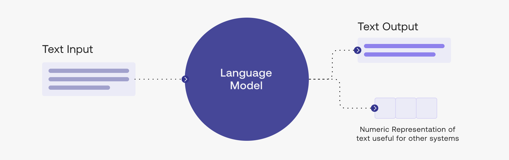

# Generative AI
Generative AI (Gen AI) is a type of artificial intelligence that is used to create new content, such as images, text, and music. Gen AI is based on the idea that computers can be programmed to generate new content by learning from existing content.

<aside>

**_Definition..._**

**_Generative AI_** is a type of AI that is used to create new content, such as images, text, and music. Gen AI is based on the idea that computers can be programmed to generate new content by learning from existing content.
</aside>

<iframe width="100%" height="415" src="https://www.youtube.com/embed/G2fqAlgmoPo" title="Linking your CSS" frameborder="0" allow="accelerometer; autoplay; clipboard-write; encrypted-media; gyroscope; picture-in-picture" allowfullscreen></iframe>

## Large Language Models (LLMs)

LLMs is like a computer version of a language expert that can read, write, and understand sentences just like a person. It is usually trained on a huge amount of text from books, articles, websites, databases, and many other sources. It learns the patterns, grammar, and meanings of words by looking at how people use them in all sorts of sentences.

The text we sent to an LLM is a called a `prompt`. The LLM takes the prompt as input and use its knowlege to generate an output. Also, most LLMs generate a numerical representations of the generated text for other use cases.

<iframe width="100%" height="415" src="https://www.youtube.com/embed/iR2O2GPbB0E" title="Linking your CSS" frameborder="0" allow="accelerometer; autoplay; clipboard-write; encrypted-media; gyroscope; picture-in-picture" allowfullscreen></iframe>

A core algorithm used in LLMs is referred to as `Transformers`, a type of neural network that works very well with text. In recent times, we've seen different LLM tools like <a href="https://chat.openai.com/" target="_blank"> **ChatGPT** </a> from _OpenAI_ and <a href="https://bard.google.com/" target="_blank"> **Bard** </a> from _Google_. These tools and many others have taken the world by storm in their applications, which are not limited to the following:

- Chat
- Text generation
- Brainstorming
- Text summarization
- Text completion
- Code generation
- Text translation

Whether we like it or not, LLMs are here to stay for a long time as individuals and businesses are already leveraging it to scale up. But the concerns around the responsible and ethical usage of such tools are still out there. These concerns includes misinformation, privacy, and bias.

<aside>

❗❗❗

**Do not believe every sensitive information an LLM output without verifying it.**
</aside>

<aside>

**_Lesson summary..._**

**_Generative AI_** is a type of AI that is used to create new content, such as images, text, and music. Gen AI is based on the idea that computers can be programmed to generate new content by learning from existing content.

LLMs is like a computer version of a language expert that can read, write, and understand sentences just like a person. It is usually trained on a huge amount of text from books, articles, websites, databases, and many other sources
</aside>

> ➡️ Next, we'll look at `Building a DL model`... 🎯