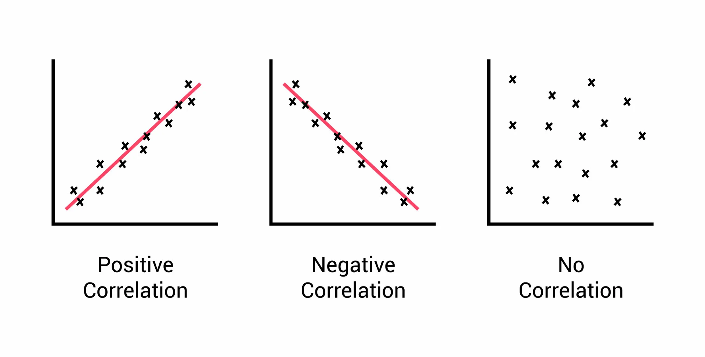
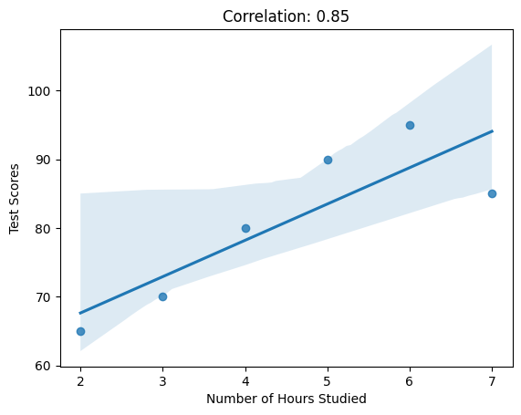

# Correlation Analysis

<aside>

**_Definition..._**

_Correlation Analysis_ is a statistical technique used to quantify the strength and direction of the relationship between two or more variables. It helps us determine the degree to which changes in one variable are associated with changes in another variable.
</aside>

To explain correlation analysis, let's consider an example. Suppose we have data on the number of hours studied and the corresponding test scores of a group of students. If there is a positive correlation between these two variables, it means that as the number of hours studied increases, the test scores also tend to increase. This suggests that studying more is associated with higher scores.

On the other hand, if there is a negative correlation, it means that as the number of hours studied increases, the test scores tend to decrease. This implies that studying more may not necessarily lead to higher scores.

Correlation is usually expressed as a value between `-1` and `+1`. A correlation coefficient of `+1` indicates a perfect positive correlation, meaning that as one variable increases, the other variable increases proportionally. A correlation coefficient of `-1` indicates a perfect negative correlation, where as one variable increases, the other variable decreases proportionally. A correlation coefficient of `0` indicates no correlation, implying that there is no relationship between the variables.



Correlation analysis helps us understand the relationship between variables, and it is often used to identify patterns, make predictions, and inform decision-making. By quantifying the correlation between variables, **we can gain insights into how changes in one variable may affect the other and make informed choices based on these relationships**.


## Correlation ≠ causation 

<div style="position: relative; padding-bottom: 56.25%; height: 0;"><iframe src="https://www.youtube.com/embed/GtV-VYdNt_g" title="Correlation" frameborder="0" allow="accelerometer; autoplay; clipboard-write; encrypted-media; gyroscope; picture-in-picture" allowfullscreen style="position: absolute; top: 0; left: 0; width: 100%; height: 100%; border: 2px solid grey;"></iframe></div>

Just because two variables are correlated does not mean that one variable directly causes the other to change. It tells us how they vary together, but it **does not** provide information about the cause-and-effect relationship between them.

In the context of the number of hours studied and test scores, a positive correlation indicates that as the number of hours studied increases 📶, the test scores tend to increase as well. However, this correlation **does not** prove that studying more directly causes higher ↗️ test scores.

```
                            Correlation ≠ causation 
```

To establish a _causal relationship_, controlled experiments, where one variable is manipulated while keeping other factors constant, are often used to determine causality. For example, a study could randomly assign students to different study time conditions and measure the impact on their test scores. This type of study design helps isolate the effect of studying on test performance and provides more evidence for causation.

<strong>

<details>

<summary>Learn more about controlled experiment</summary>

<div style="position: relative; padding-bottom: 56.25%; height: 0;"><iframe src="https://www.youtube.com/embed/kkBDa-ICvyY" title="Correlation" frameborder="0" allow="accelerometer; autoplay; clipboard-write; encrypted-media; gyroscope; picture-in-picture" allowfullscreen style="position: absolute; top: 0; left: 0; width: 100%; height: 100%; border: 2px solid grey;"></iframe></div>

</details>

</strong>


### Correlation analysis using Seaborn
Here's a code snippet using `Numpy` and `Seaborn` to calculate and plot the correlation between the number of hours studied and test scores.

> **Note**: Seaborn library will be explored in subsequent lessons. Hence, don't stress much about it right now.

<iframe src="https://trinket.io/embed/python3/e2016739fe?toggleCode=true&runOption=run" width="100%" height="356" frameborder="0" marginwidth="0" marginheight="0" allowfullscreen></iframe>

We use the `np.corrcoef()` function from Numpy to calculate the correlation coefficient between the number of hours studied and test scores. Next, we use Seaborn's `regplot()` function to create a scatter plot with a linear regression line, showing the relationship between the two variables. If we run the above code snippet, then we can see the plot below.



By calculating the correlation coefficient, we can quantify the strength of the relationship between hours studied and test scores. This information can help us understand how changes in study hours may impact test performance and guide decision-making regarding study strategies or resource allocation for improving academic performance.

<aside>

**_Lesson summary..._**

Correlation analysis is a valuable tool in data science and can help us understand the relationships between variables, make predictions, and inform decision-making processes. It enables us to quantify and measure the associations between variables, providing valuable insights into the data and facilitating evidence-based analysis.
</aside>


### 👩🏾‍🎨 Practice: Correlation analysis... 📝

Imagine you have collected data about movie ratings from a group of people. Here's a simplified dataset representing the number of hours spent watching movies per week and the corresponding average rating given by each person:

```python
Hours Watched: [6, 8, 5, 4, 9, 7, 3, 2, 7, 5]
Ratings:       [4.5, 3.8, 4.0, 3.2, 4.7, 4.3, 2.9, 3.1, 4.2, 3.8]
```

1. Calculate the **correlation coefficient** between the hours watched and the ratings.
2. Interpret the correlation coefficient value. What does it suggest about the relationship between hours watched and movie ratings?


> ➡️ In the next lesson, we'll be looking into `visualization` in EDA 🎯.