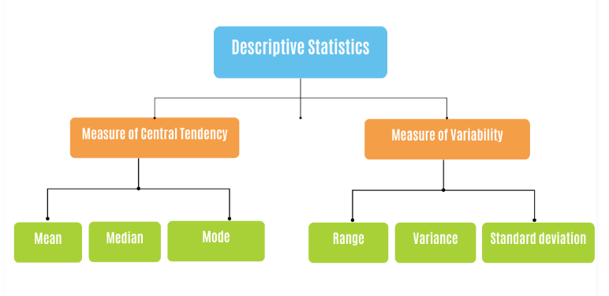

# Descriptive Statistics
Descriptive statistics play a crucial role in helping us understand and make sense of a dataset by providing a summarized view of the data, and allowing us to gain valuable insights and draw meaningful conclusions about our data. To conduct descriptive statistics on a dataset, we can either look at `measures of central tendency` or a bit deeper into `measures of dispersion` of the dataset.  



In this lesson, we'll only focus on **measures of central tendency**, while measures of dispersion will be discussed in the next lesson.

## Measures of central tendency

<aside>

**_Definition..._**

Measures of central tendency are statistical measures that help us understand the typical or central value of a dataset. They provide us with a single value that represents the _center_ or _average_ of the data.

</aside>

<div style="position: relative; padding-bottom: 56.25%; height: 0;"><iframe src="https://www.youtube.com/embed/kn83BA7cRNM" title="Web Scrapping Intro" frameborder="0" allow="accelerometer; autoplay; clipboard-write; encrypted-media; gyroscope; picture-in-picture" allowfullscreen style="position: absolute; top: 0; left: 0; width: 100%; height: 100%; border: 2px solid grey;"></iframe></div>

To understand this better, let's take the height of students in a class as a data to explain the _mean, median_, and _mode_.

### Mean
The mean is the most common measure of central tendency. It is calculated by adding up all the values in the dataset and dividing the sum by the total number of values. Suppose we have the heights of five students in centimeters: `150, 160, 165, 170`, and `175`. To find the mean height, we add up all the heights and divide by the total number of students (in this case, 5). So, 

<aside>

```python
(150 + 160 + 165 + 170 + 175) / 5 = 164 cm
```
</aside>

The mean height of the students is `164 cm`, which represents the average height.

### Median
The median is another measure of central tendency. It represents the middle value in a dataset when the values are arranged in order. If there is an odd number of values, the median is the middle value itself. For example, If we arrange the heights in ascending order: 150, 160, 165, 170, 175, the median is the middle value. In this case, the middle value is `165 cm`. 

The median represents the height at which half of the students are taller and half are shorter. _It is not affected by extreme values, so even if we had an unusually tall or short student, the median would remain the same_. However, if there is an even number of values, the median is the average of the two middle values. For example, in the dataset (`150, 150, 160, 165, 170, 175`), the median is 

<aside>

```python
(15 + 20) / 2 = 17.5
```
</aside>
The median is mostly less affected by extreme values and provides a robust measure of central tendency.

### Mode
The mode is the value that appears most frequently in a dataset. It represents the most common or popular value. For example, if we observe the heights, we see that no height is repeated in this dataset. Therefore, there is no mode. If, however, we had two students with a height of `160 cm`, then the mode would be `160 cm`, as it appears more frequently than any other height.

## Measures of central tendency in Pandas
Imagine you have a spreadsheet with a list of numbers representing student heights. Using pandas, you can load this data into a DataFrame, which is a tabular structure similar to a table. Once the data is in the DataFrame, you can easily calculate measures of central tendency.

Here's a sample code using Pandas to calculate the _mean, median_, and _mode_ of student heights:

<aside>

```python
import pandas as pd

# Create a pandas Series with student heights
heights = pd.Series([150, 160, 165, 170, 175])

# Calculate the mean
mean_height = heights.mean()
print("Mean Height:", mean_height)

# Calculate the median
median_height = heights.median()
print("Median Height:", median_height)

# Calculate the mode
mode_height = heights.mode()
print("Mode Height:", mode_height)
```

</aside>

In the code above, we first create a pandas Series called heights that contains the student heights. We then use the `.mean()` method to calculate the mean height, the `.median()` method to calculate the median height, and the `.mode()` method to calculate the mode height. After running the code snippet above, here is the output of the measure of central tendency:

    Mean Height: 164.0
    Median Height: 165.0
    Mode Height: 0    150

## Visualization in Descriptive statistics

<div style="position: relative; padding-bottom: 56.25%; height: 0;"><iframe src="https://www.youtube.com/embed/txNvZ3Zndak" title="Web Scrapping Intro" frameborder="0" allow="accelerometer; autoplay; clipboard-write; encrypted-media; gyroscope; picture-in-picture" allowfullscreen style="position: absolute; top: 0; left: 0; width: 100%; height: 100%; border: 2px solid grey;"></iframe></div>

Visualizing data in descriptive statistics enhances our understanding by providing a visual representation of the information. It helps us identify patterns, trends, and potential outliers in the data. 

Additionally, it makes it easier to communicate findings to others who may not be familiar with statistical concepts, allowing for a more engaging and intuitive interpretation of the data. 

By leveraging visualizations, we can better explore, interpret, and communicate the main characteristics of the data in descriptive statistics.

<aside>

**_Lesson summary..._**

**Descriptive statistics** are essential in data science because they help us understand the dataset, explore the data, compare and benchmark different aspects, and effectively communicate findings. They also provide us with a foundation for further analysis, decision-making, and drawing valuable insights from our data.

</aside>

> **👩🏾‍🎨 Practice: Measures of central tendency... 🎯**


 <br><br>

> ➡️ Next, we'll be exploring more on descriptive statistics - `measures of dispersion` 🎯.


</aside>