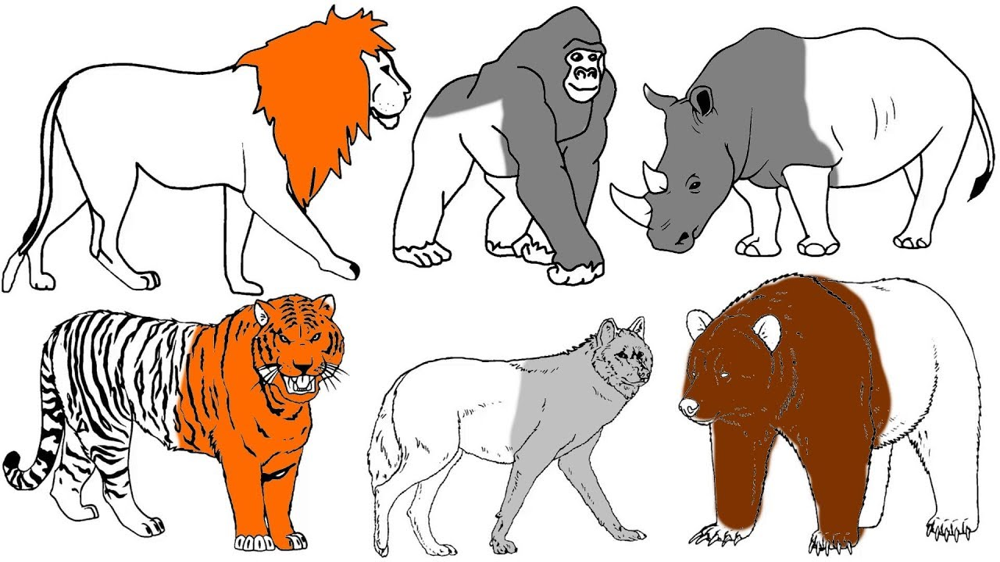

# Feature Extraction

<aside>

**_Definition..._**

**_Feature extraction_** is a process of transforming raw data into a new representation that is more suitable for machine learning algorithms. It involves taking the original data, which may contain many complex and irrelevant details, and transforming it into a more concise and meaningful representation.
</aside>

Imagine you have a large collection of colorful pictures of animals, each depicting different types of animals like lion, Gorilla, Hippopotamus, leopard, and polar bear. However, you don't know much about the specific characteristics that make each animal unique. You want to find a way to capture the essential features of each animal so that you can recognize and categorize them more easily.

This can be done by reducing the dimensionality of the data, by transforming the data into a different representation, or by extracting features that are known to be important for the task at hand.

In data science, feature extraction is like finding the key traits or characteristics of these animals that help you identify and classify them. Instead of using the entire image, which can be overwhelming, feature extraction techniques help you pick out **specific patterns or properties that are most relevant** to the task at hand. These features can be things like the number of legs, the shape of the ears, the color of the fur, or the size of the animal.

<aside>

**_ NOTE! _**

_Feature extraction_ is a a generic concept with wide applications, however, it is more applicable to text and image data. Consequently, we'll focus more on this concept in subsequent weeks. 
</aside>

## Feature extraction vs Feature selection
Imagine you have a basket of different fruits, and you want to make a delicious fruit salad. Feature extraction is like creating a new fruit salad with only a few key fruits that represent the overall taste and flavors. It involves combining and transforming the original fruits to create a simplified version that still captures the essence of the salad.

On the other hand, feature selection is like picking out the best fruits from the basket to include in your salad. It involves choosing specific fruits based on their individual taste and quality, leaving out the ones that might not add much value to the final dish.

<iframe src="https://www.youtube.com/embed/pr5LXi4U10c" title="Web Scrapping Intro" frameborder="0" allow="accelerometer; autoplay; clipboard-write; encrypted-media; gyroscope; picture-in-picture" allowfullscreen style="position: absolute; top: 0; left: 0; width: 100%; height: 100%; border: 2px solid grey;"></iframe>

<aside>

**_Lesson Summary..._**

**_Feature extraction_** is about creating new, more meaningful features by combining or transforming the original ones, making it easier to understand and work with the data. **_Feature selection_**, on the other hand, is about picking the most relevant and informative features from the existing ones, so that you can focus on the most important aspects of your data and improve the accuracy and efficiency of your analysis or machine learning models.
</aside>

### 👩🏾‍🎨 Practice: Feature extraction... 🎯

 

> ➡️ Next, we'll look at some practice exercises... 🎯.

