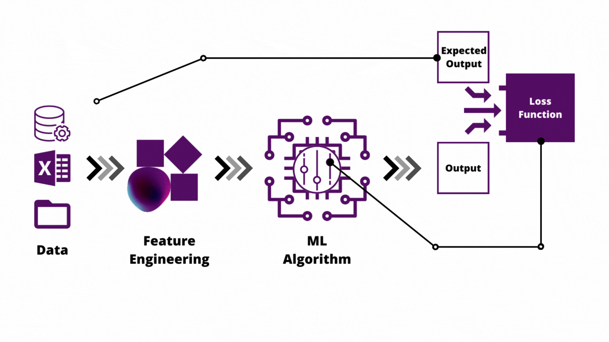

# Intro to Feature Engineering

Imagine a retail business has a dataset that includes customer information such as _age, gender, income_, and the _number of products_ purchased. Their goal is to build a model that can accurately predict whether a customer will make a high-value purchase.

At first glance, the dataset may seem straightforward, but feature engineering can help improve the accuracy of the predictive model by creating new features such as `total spending`, `income category`, and `age group`. But what exactly do we mean by _features_?

## What are features?

<aside>

**_Defnintion..._**

**_Features_**, also referred to as _variables_ or _attributes_,  can be thought of as a characteristic or attribute that describes something of interest in a dataset. It represents a specific piece of information about each item or entity in the dataset.
</aside>

To better understand this, let's consider an example of a dataset containing information about _weather_. Each record in the dataset may have various features that describe different aspects of the weather, such as _longitude, latitude, humidity, wind direction_, and _atmospheric pressure_. Hence, these characteristics of each weather records are referred to as the **weather features**.

Features are like building blocks that, when combined, provide a comprehensive picture of the data. However, the features in a dataset largely depends on the type of information in the data. Hence, the question now is _what makes a good feature in a dataset?_

<iframe src="https://www.youtube.com/embed/N9fDIAflCMY" title="Web Scrapping Intro" frameborder="0" allow="accelerometer; autoplay; clipboard-write; encrypted-media; gyroscope; picture-in-picture" allowfullscreen style="position: absolute; top: 0; left: 0; width: 100%; height: 100%; border: 2px solid grey;"></iframe>

### Practice
Now that you have an idea of what makes a good feature in dataset, take a look at this **[ COVID-19 dataset](https://docs.google.com/spreadsheets/d/1M2gonoN_dLE2Itn06FgbFCV-FMJGyG-BqGh8wIpspRw/edit?usp=sharing)** and mention TWO features that are NOT relevant to the analysis of COVID-19 cases according to the information provided.

> **Try to first work on this without checking the answer**

 Reveal answer 

There are features such as `New Cases` and `New Deaths` that are not relevant as their values are empty. This will not help in our analysis. However, if the features were only missing few values, then we can use different techniques covered already to handle that and they'll be used in the analysis.

## Feature Engineering

<aside>

**_Defnintion..._**

**_Feature engineering_** is the process of creating new, meaningful features or modifying existing ones in a dataset to improve the performance and accuracy of machine learning models, and capture the underlying patterns and relationships.

</aside>

As an analogy, _feature engineering_ is like a craftsman shaping and refining the materials before building something. It's similar to a painter adding brushstrokes or a sculptor chiseling away to create a masterpiece. By carefully selecting, transforming, and creating features, data scientists can enhance the predictive power and understanding of their models.

<iframe src="https://www.youtube.com/embed/pYVScuY-GPk?si=-1Q1fKnTDuB_-X2k" title="Web Scrapping Intro" frameborder="0" allow="accelerometer; autoplay; clipboard-write; encrypted-media; gyroscope; picture-in-picture" allowfullscreen style="position: absolute; top: 0; left: 0; width: 100%; height: 100%; border: 2px solid grey;"></iframe>

For predictive models, the more features in a dataset, the more information and patterns to learn from the data, thereby improving the the model's predictive power. Let's look at some examples. 

### Example 1
Imagine you're a shop owner and a person comes up to you and asks for a tobacco. You proceed to ask for ID and you see the person's birthday is `09/12/1998`.

This information is not inherently meaningful, but you add up the number of years by doing some quick mental math and find out the person is 25 years old (which is above the legal smoking age). What happened there? You took a piece of information `09/12/1998` and transformed it to become another variable `age` to solve the question you had - _Is this person allowed to smoke?_ - that is feature engineering!

### Example 2
Imagine a company that offers a streaming music service with a subscription model. They have a dataset containing information about their customers, such as `age`, `gender`, `location`, `subscription duration`, and the `number of songs listened to per day`. The company wants to improve their marketing efforts by identifying potential customers who are more likely to renew their subscriptions.

By leveraging feature engineering techniques, the company can create new features or modify existing ones to capture important customer behaviors and characteristics, such as creating features that capture `engagement levels`, `playlist diversity`, and `usage patterns`. 

- **Engagement Level**: by combining the number of songs listened to per day and the subscription duration.
- **Playlist Diversity**: by creating a feature that measures the diversity of music genres in a customer's playlist.
- **Usage Patterns**: generating features that capture usage patterns, such as _peak listening times_ or _average session duration_.

These engineered features help identify customers more likely to renew their subscriptions, consequently enabling targeted marketing campaigns.

<aside>

**_Lesson summary..._**

**_Feature engineering_** is vital for individual and businesses as it allows us to uncover valuable insights hidden within our data. By creating new features or modifying existing ones, businesses can gain a deeper understanding of customer behaviors, preferences, and engagement levels. 

This, in turn, enables us to make informed decisions, personalize marketing efforts, and enhance customer satisfaction, ultimately leading to improved business outcomes.

</aside>

> ➡️ In the next section, we'll be looking at `Feature transformation` 🎯.

