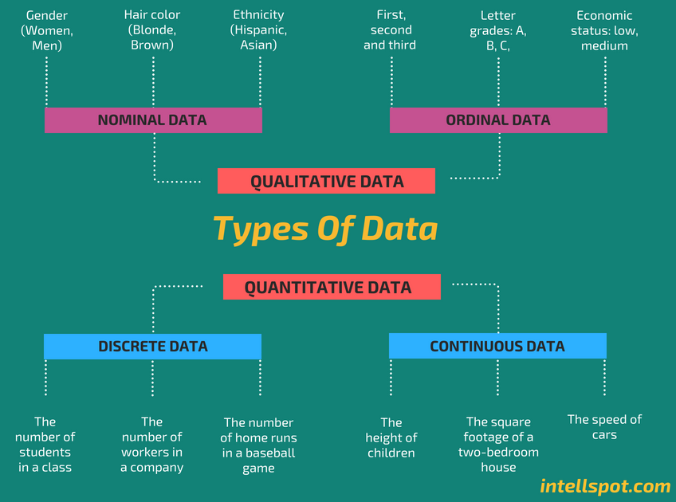

# Data Types

## _What is data?_

<aside>

**_Definition_**

Data is any information that is collected, stored, and analyzed to generate insights and inform decision-making.

</aside>

<!-- 
<iframe src="https://www.youtube.com/embed/2X9pv7FUrOk" title="Sample Data Science Project" frameborder="0" allow="accelerometer; autoplay; clipboard-write; encrypted-media; gyroscope; picture-in-picture" allowfullscreen style="position: absolute; top: 0; left: 0; width: 100%; height: 100%;"></iframe>
 -->

Data is increasing rapidly due to several factors... 
- rise of digital technologies 
- growing use of the internet and social media 
- increasing number of devices and sensors that generate data. 

In fact, it is estimated that the amount of data generated worldwide will reach 180 zettabytes by 2025, up from just 4.4 zettabytes in 2013. This explosion of data presents both opportunities and challenges for data scientists, who must find ways to extract insights and value from this vast and complex data landscape.

>👩🏾‍🎨  **_...Data is the new electricity in town..._**

Just as electricity transformed industries such as manufacturing, transportation, and communications, _**data**_ is transforming modern-day businesses and organizations across various domains. Currently, it is being generated and consumed globally at an unprecedented rate, and it has become a valuable resource that drives innovation, growth, and competitiveness. Consequently, we now live in the era of `big data`. 

<aside>

📺 Here's what you need to know about big data  

</aside>

<iframe src="https://www.youtube.com/embed/bAyrObl7TYE" title="Sample Data Science Project" frameborder="0" allow="accelerometer; autoplay; clipboard-write; encrypted-media; gyroscope; picture-in-picture" allowfullscreen style="position: absolute; top: 0; left: 0; width: 100%; height: 100%;"></iframe>

<!-- # ghjjd

 -->

## Data Types
The data we have today are in different forms such as social media likes and posts, online purchase, gaming, business transactions, and online movie streaming among others. Understanding the types of data that you are working with is essential in ensuring that you are using the appropriate methods to analyze and manipulate it. _Data types_ refer to the classification or categorization of variables based on the nature of the data they represent. Common data types are represented in the image below.

 

These data types are essential for understanding the characteristics and properties of the data and determining appropriate analysis techniques. Let's take a look at each of this data tpes...

- **Numerical Data**: This includes any data that can be represented by numbers, such as height, weight, temperature, or time.

- **Categorical Data**: This includes data that falls into categories or groups, such as gender, race, or occupation.

- **Text Data**: This includes any data in the form of written or spoken language, such as customer reviews, social media posts, or news articles.

- **Time Series Data**: This includes data that is collected over time, such as stock prices, weather patterns, or website traffic.

- **Spatial Data**: This includes data that is associated with a specific location or geographic area, such as GPS coordinates or city population.

- **Image and Video Data**: This includes any data in the form of digital images or videos, such as satellite imagery, medical scans, or security footage.

- **Graph and Network Data**: This includes data that is organized in the form of nodes and edges, such as social networks or transportation networks.

- **Sensor Data**: This includes data collected from sensors, such as pollution sensors, traffic sensors, temperature sensors, pressure sensors, or motion sensors.

- **Transactional Data**: This includes data associated with business transactions, such as sales data, customer orders, or financial transactions.

> **Note**: Sometimes, it is required to convert from one data type to another before analysis or visualization. This conversion is part of _data wrangling_ or _data preprocessing_.

<!-- 
### Data categories
Now that we understand some data types, let's look at data based on certain characteristics and attribute. 
In its raw form, _data_ can be categorized into **qualitative** and **quantitative** types based on their characteristics and attributes. Each of this type can further be broken as _nominal, ordinal, discrete_, and _continuous_.

- Quantitative data refers to numerical or measurable data that can be expressed in terms of numbers, such as height, weight, temperature, and sales figures. 

- Qualitative data, on the other hand, refers to non-numerical data that cannot be expressed in terms of numbers, such as opinions, attitudes, and beliefs.
 -->

## 👩🏾‍🎨 Practice: Data type taxonomies
With your knowledge of data and different data types, check your understanding by attempting the foling questions: 
1. Group the following sample data into their suitable data types.
    - age
    - income
    - GPS coordinates
    - maps
    - product type
    - stock prices
    - web traffic
    - moview reviews
    - ethnicity

2. Do you think any of the sample data should be in more than one category?

> 👉🏾 In the next section, we'll look at data science tools and explore some sample dataset.
