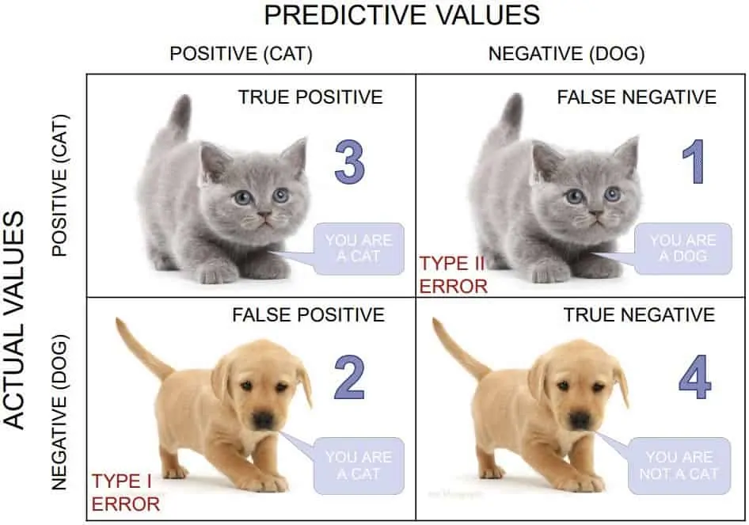
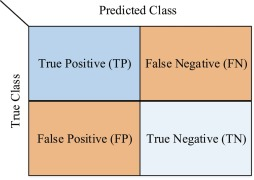

# Confusion Matrix

Imagine you have a friend who loves playing a game where they have to identify animals based on pictures. To see how well they are doing, you give them some animal pictures to classify, and they tell you whether it's a cat or dog. Now, you have a list of correct answers for each picture. The confusion matrix is like a table that helps you see how many animals your friend got right and how many they got wrong.

  


In the confusion matrix, the rows represent the actual animals in the pictures (cats aand dogs), and the columns represent what your friend guessed (also cats and dogs). Each cell in the matrix shows the number of times your friend got it right or wrong. For example, if your friend correctly identified 3 cats, that number would be in the "Cat" row and "Cat" column. If they thought a dog was a cat, that number would be in the "Dog" row and "Cat" column.

<aside>

**_Definition..._**

**_Confusion matrix_** is a table that is used to evaluate the performance of a classification model. It shows the number of instances that were correctly classified and the number of instances that were misclassified.
</aside>

<div style="position: relative; padding-bottom: 56.25%; height: 0;"><iframe src="https://www.youtube.com/embed/_cpiuMuFj3U" title="Machine Learning" frameborder="0" allow="accelerometer; autoplay; clipboard-write; encrypted-media; gyroscope; picture-in-picture" allowfullscreen style="position: absolute; top: 0; left: 0; width: 100%; height: 100%; border: 2px solid grey;"></iframe></div>

It is usually a square matrix with the number of rows and columns equal to the number of classes in the classification problem. The rows of the confusion matrix represent the **actual** class labels, while the columns represent the **predicted** class labels. To evaluate a model with confusion matrix, we use 4 metrics:
- **True Positive (TP)**: These are the cases where the model correctly predicts a picture of a cat as a cat. In other words, the model identifies a cat image, and it is indeed a cat.
- **False Positive (FP)**: These are the cases where the model incorrectly predicts a picture of a cat as a dog. In other words, the model identifies a cat image, but it is actually a dog.
- **True Negative (TN)**: These are the cases where the model correctly predicts a picture of a dog as a dog. In other words, the model identifies a dog image, and it is indeed a dog.
- **False Negative (TN)**: These are the cases where the model incorrectly predicts a picture of a dog as a cat. In other words, the model identifies a dog image, but it is actually a cat.

<br>

 

By understanding TP, FP, TN, and FN, we can evaluate the performance of our model in correctly classifying cat and dog images and make improvements if needed.

## Precicion, Recall, and F1 Score
Precision, recall, and F1 score are another se of important evaluation metrics in machine learning, especially in binary classification problems (such as spam vs. non-spam emails or cat vs. dog images). These metrics help us understand the performance of our model and make informed decisions about its effectiveness.

<br>
<div style="position: relative; padding-bottom: 56.25%; height: 0;"><iframe src="https://www.youtube.com/embed/qWfzIYCvBqo" title="Recall and Precision" frameborder="0" allow="accelerometer; autoplay; clipboard-write; encrypted-media; gyroscope; picture-in-picture" allowfullscreen style="position: absolute; top: 0; left: 0; width: 100%; height: 100%; border: 2px solid grey;"></iframe></div>

**Precision**: Precision is the ratio of true positive predictions (correctly predicted positive instances) to the total number of positive predictions (both true positive and false positive). It measures how accurate our model is when it predicts positive instances. A high precision indicates that when the model predicts a positive class, it is likely to be correct. For example, in the context of a spam detection model, high precision means that most of the emails classified as spam are indeed spam, reducing false alarms.

```
                                       TP     
                    Precision  =   ----------- 
                                    TP + FP 
```

**Recall (Sensitivity)**: Recall is the ratio of true positive predictions to the total number of actual positive instances in the dataset. It measures how well the model is capturing all the positive instances. A high recall indicates that the model can identify most of the positive instances correctly. For example, in a medical diagnosis model, high recall means that the model is good at identifying most of the actual positive cases, minimizing false negatives.

```
                                     TP     
                    Recall  =  --------------- 
                                TP + (FP + FN) 
```

**F1 Score**: The F1 score is the harmonic mean of precision and recall. It provides a balance between precision and recall, allowing us to consider both metrics together. The F1 score is useful when we have imbalanced classes, where one class is much more prevalent than the other. It helps find a balance between reducing false positives and false negatives. A higher F1 score indicates a better balance between precision and recall.

```
                                           TP       
                    Precision  =   -------------------- 
                                         1             
                                    TP + - (FP  +  FN) 
                                         2             
```

## Implemeting the evaluation metrics
Now, let's look at how we can build a classification model and evaluate it using the metrics. Let's use the `Breast Cancer` dataset from scikit-learn, which is a popular dataset for binary classification tasks. The goal is to predict whether a breast cancer tumor is malignant `(1)` or benign `(0)` based on features like mean radius, mean texture, mean smoothness, etc.

<iframe src="https://trinket.io/embed/python3/188b4e846e?toggleCode=true&runOption=run" width="100%" height="356" frameborder="0" marginwidth="0" marginheight="0" allowfullscreen></iframe>

In this example, we load the Breast Cancer dataset and split it into training and testing sets. We then create and train a `Logistic Regression` model to predict whether a tumor is malignant or benign. After making predictions on the test set, we calculate the precision, recall, and F1 score using the corresponding functions from sklearn.metrics.

<aside>

**_Remember..._** 

- Each dataset may have different characteristics, and the choice of the model and its evaluation metrics can vary based on the specific problem you are trying to solve. 
- The key is to understand the dataset, choose an appropriate model, and use suitable evaluation metrics to measure the model's performance accurately.
</aside>

### 👩🏾‍🎨 Practice: Confusion matrix... 🎯

**Confusion Matrix Practice Exercise**

You are given a dataset containing the results of a medical test for a certain disease. The test provides two possible outcomes: `Positive` and `Negative`. Your task is to understand and analyze the results using a confusion matrix.

**Dataset: Medical Test Results**

| Actual Outcome | Predicted Outcome |
|----------------|-------------------|
| Positive       | Positive          |
| Negative       | Negative          |
| Positive       | Negative          |
| Negative       | Positive          |
| Positive       | Positive          |
| Negative       | Negative          |
| Negative       | Negative          |
| Positive       | Positive          |
| Negative       | Negative          |
| Negative       | Negative          |

**Questions...**

- What does the "Actual Outcome" column represent in the dataset?
  - The actual test results
  - The predicted test results
  - The true health status
- What does the "Predicted Outcome" column represent in the dataset?
  - The actual test results
  - The predicted test results
  - The true health status
- What is the purpose of a confusion matrix?
  - To analyze medical test results
  - To visualize data
  - To summarize a machine learning model's performance

- Calculate the True Positive (TP) value from the given dataset.
- Calculate the False Positive (FP) value from the given dataset.
- Calculate the True Negative (TN) value from the given dataset.
- Calculate the False Negative (FN) value from the given dataset.
- Using the calculated values, construct the confusion matrix.


<br>

> ➡️ Next, we'll look at `Overfitting and underfitting`... 🎯