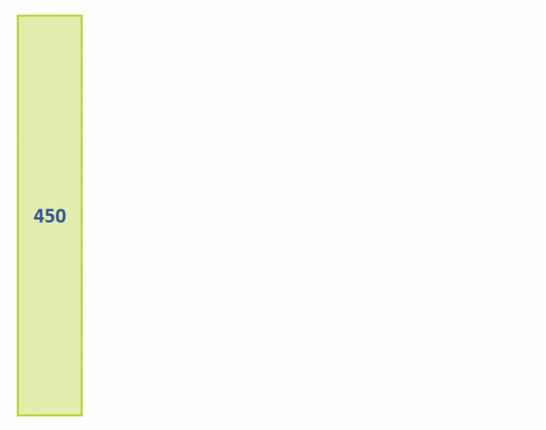

# Cross validation

Imagine the student from the previous example wants to make sure they are well-prepared for the math exam. Instead of relying solely on their practice problems from the textbook, they decide to take a set of _practice exams_ that their teacher has prepared. The teacher gives them several different exams, each covering a different set of problems.


After completing each practice exam, the student reviews their performance and identifies areas where they struggled. They use this feedback to improve their understanding and practice more on the challenging topics. By taking multiple practice exams, the student ensures that they are prepared for any type of question that may appear in the real exam.

<aside>

**_Definition..._**

**_Cross-validation_** is a technique used in machine learning to ensure that our model performs well on new, unseen data and to avoid both overfitting and underfitting. It's like a special test we give to our model to check if it really understands the data.
</aside>

This involves dividing the data into multiple subsets or `folds` and training the model on different combinations of these folds. This process helps the model learn from different parts of the data and ensures that it generalizes well to unseen data. 


By evaluating the model's performance on multiple test sets, we can have a better idea of how well it will perform on new, unseen data, and we can identify and address potential issues like overfitting or underfitting. This helps us build a more reliable and robust ML model that performs well in real-world situations. 

Similarly, it ensures that the model truly understands the underlying patterns in the data, just like the student gains a better understanding of the material by taking different practice exams. To achieve this, let's look at different types of cross-validations:

- K-fold cross-validation.
- Hold-out cross-validation.
- Leave-One-Out cross-validation.
- Leave-_P_-Out cross-validation.
- Stratified k-fold cross-validation.

In this lesson, we'll only focus on the first three categories - _K-fold_ and _Leave-One-Out_. For _Hold-out_ technique, this is what we have used so far in this course, which involves splitting our entire dataset into training and testing using percentage split. For example, using `70:30` or `80:20` percentage split. 

## 1. _k_-fold cross-validation
To evaluate the performance of our ML models, _K-fold_ cross-validation involves splitting the dataset into k subsets or **folds**. The model is trained `k` times, each time using a different fold as the validation set and the remaining folds as the training set. This way, each data point gets a chance to be in the validation set exactly once, and we have total control on what the value of `k`should be.

The final evaluation is usually the average of the performance measures obtained in each iteration. _K-fold_ cross-validation helps to provide a more robust and reliable estimate of how well the model will perform on unseen data, avoiding overfitting and ensuring generalizability. The general approach to follow while carrying out _K-fold_ cross validation is as follows:
1. Randomly rearrange the dataset.
2. Divide the dataset into k distinct groups.
3. For each group in the dataset:
    - Set aside the current group as a test dataset.
    - Use the remaining groups as a training dataset.
    - Train a model on the training dataset and assess its performance on the test dataset.
    - Record the evaluation score and discard the model after each iteration.
4. Aggregate the model evaluation scores to summarize the overall performance of the model.

In the example below, we assumed we have 450 data points in a dataset and use 10 as our _k_ (i.e., `k=10`). Hence, we divided the dataset into `10` equal folds. For every iteration, we use `9` folds for training and `1` fold for testing. 



<aside>

**Check your understanding...**

Suppose you have a model developed using the dataset represented in the dataframe below. How would your dataset look like after applying _K-fold cross-validation_? Remember to include the value of `k`.

```python
data = {
    'Feature1': [3, 7, 2, 8, 5, 4, 6, 9, 1, 4, 6, 2, 7, 3, 5],
    'Feature2': [15, 20, 10, 25, 18, 22, 12, 28, 30, 24, 16, 19, 21, 26, 23],
    'Feature3': [2.5, 3.1, 2.2, 2.8, 2.6, 3.0, 2.9, 2.4, 2.3, 2.7, 2.1, 2.0, 2.6, 2.8, 2.4],
    'Feature4': ['A', 'B', 'C', 'B', 'A', 'C', 'B', 'A', 'C', 'B', 'A', 'B', 'C', 'A', 'C'],
    'Feature5': [True, False, False, True, True, False, False, True, False, True, True, False, False, True, False]
}
```

➡️ Give this a try before revealing the answer

<details>
<summary><b> Reveal answer - K-fold cross-validation </b></summary>

After applying K-fold cross-validation with k=5, we would have 5 different splits of the data into training and test sets. Each fold will be used as a test set once, and the remaining four folds as training sets. Here's an example of the five splits:

**Split 1**:

- Training set: Rows 3, 4, 5, 6, 7, 8, 9, 10, 11, 12, 13, 14
- Test set: Rows 0, 1, 2

**Split 2**:

- Training set: Rows 0, 1, 2, 6, 7, 8, 9, 10, 11, 12, 13, 14
- Test set: Rows 3, 4, 5

**Split 3**:

- Training set: Rows 0, 1, 2, 3, 4, 5, 9, 10, 11, 12, 13, 14
- Test set: Rows 6, 7, 8

**Split 4**:

- Training set: Rows 0, 1, 2, 3, 4, 5, 6, 7, 8, 12, 13, 14
- Test set: Rows 9, 10, 11

**Split 5**:

- Training set: Rows 0, 1, 2, 3, 4, 5, 6, 7, 8, 9, 10, 11
- Test set: Rows 12, 13, 14
</details>

</aside>

## 2. Leave-One-Out cross-validation
Leave-One-Out Cross-Validation (LOOCV) is a type of k-fold cross-validation where k is equal to the number of data points in the dataset. In LOOCV, each data point is treated as a separate test set, and the model is trained on all the other data points. This process is repeated for each data point, and the model's performance is evaluated based on how well it predicts the left-out data point.

1. For each data point in the dataset
    - set aside as the validation set, while the remaining (`n-1`) data points for training.
    - repeat step for each data point in the dataset, so that every data point gets to be in the validation set once.
2. The final evaluation is the average of the performance measures obtained for each iteration.


LOOCV is an exhaustive and computationally expensive technique, especially for large datasets, as it requires training the model multiple times. However, it provides an unbiased estimate of the model's performance since it evaluates the model on all available data points, leaving out one at a time. LOOCV is particularly useful when the dataset is small, and there is a need for a thorough evaluation of the model's ability to generalize to unseen data.

Now, try to guess how **Leave-_P_-Out cross-validation** cross validation techniques works. You can take a cue from LOOCV.

<details>
<summary><b> Reveal answer - Leave-P-Out cross-validation </b></summary>

The total number of data points (`n`) is used to separate a set of data points that is used for testing. These data points are referred to as (`p`). Unlike LOOCV, the training data set is obtained by calculating (`n-p`) and the model is trained accordingly. Once the training is done, `p` data points are used for cross-validation. 
</details>

> Implementation of different cross validation techniques

<div style="position: relative; padding-bottom: 56.25%; height: 0;"><iframe src="https://www.youtube.com/embed/-8s9KuNo5SA" title="Cross Validation" frameborder="0" allow="accelerometer; autoplay; clipboard-write; encrypted-media; gyroscope; picture-in-picture" allowfullscreen style="position: absolute; top: 0; left: 0; width: 100%; height: 100%; border: 2px solid grey;"></iframe></div>


<aside>

**_Lesson Summary..._**

**_Feature extraction_** is about creating new, more meaningful features by combining or transforming the original ones, making it easier to understand and work with the data. **_Feature selection_**, on the other hand, is about picking the most relevant and informative features from the existing ones, so that you can focus on the most important aspects of your data and improve the accuracy and efficiency of your analysis or machine learning models.
</aside>


### 👩🏾‍🎨 Practice: Stratified k-fold cross-validation... 🎯
Read the following documentation to learn what Stratified k-fold cross-validation is and how you can apply it.

**[Stratified k-fold cross-validation doc](https://scikit-learn.org/stable/modules/generated/sklearn.model_selection.StratifiedKFold.html#:~:text=Stratified%20K%2DFolds%20cross%2Dvalidator,of%20samples%20for%20each%20class.)**

> ➡️ Next, we'll look at `Regression evaluation`... 🎯.