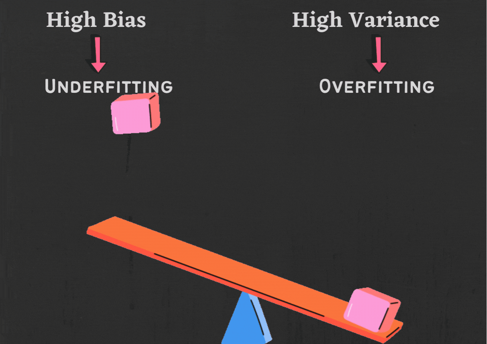

# Overfitting and underfitting
In previous lessons, we've seen how we can build and evaluate an ML model to be sure of its performance. However, what happens if our ML model performs well during evaluation but fails to generalize (or perform) to new, unseen data? Sometimes, our model can either just memorize the training data or doesn't learn any pattern from it, leading to irregular balance and poor performance.

## Overfitting
Imagine a student is preparing for a math exam. They have a textbook with several example problems and solutions. The student spends hours memorizing the solutions to those specific problems, hoping to see similar questions on the exam.

When the exam day arrives, they encounter a set of questions that are slightly different from the ones they memorized. Despite their efforts to recall the exact solutions they memorized, they struggle to apply them to the new problems. As a result, they don't perform as well as they expected, even though they knew the answers to the problems they memorized. This is an example of _overfitting_.

<!-- Imagine you are trying to learn how to recognize different types of animals based on pictures. You have a set of pictures of cats, dogs, and birds, and you want to teach a computer to classify them correctly.

To do this, you train the model on a large dataset of pictures, showing it which pictures are of cats, dogs, and birds. After training, the model performs really well, correctly classifying most of the pictures. However, when you give it a picture of a rare bird species that it has never encountered during training, it struggles to recognize it and may even classify it as a different animal. This is an example of _overfitting_. -->

<aside>

**_Definition..._**

**_Overfitting_** is when a model memorized the details in the training data too well, and as a result, it does not generalize well to new data. This can lead to the model making inaccurate predictions on new data.
</aside>

<iframe src="https://www.youtube.com/embed/MDiZg88mg9c" title="Machine Learning" frameborder="0" allow="accelerometer; autoplay; clipboard-write; encrypted-media; gyroscope; picture-in-picture" allowfullscreen style="position: absolute; top: 0; left: 0; width: 100%; height: 100%; border: 2px solid grey;"></iframe>

Overfitting occurs when a model becomes too complex and captures noise or random fluctuations in the training data rather than learning the underlying patterns. Some common causes of overfitting include:

- **Insufficient training data**: When the training dataset is small, the model may not capture the full complexity of the underlying relationships, leading to overfitting.
- **Too many features**: If a model has too many features, it can start to memorize the training data instead of learning the underlying patterns. This can lead to overfitting.
- **Data Imbalance**: In classification tasks, when one class dominates the dataset and is significantly more frequent than the others, the model may favor the dominant class and struggle to correctly predict the less frequent classes.
- **High variance**: High variance means that the model is sensitive to small changes in the training data. This can lead to overfitting, as the model will learn the noise in the training data instead of the underlying patterns.

## Underfitting
Using same example of a student preparing for a math exam, suppose this time the student is not putting enough effort into studying and is only glancing briefly at the textbook without really understanding the concepts.

When the exam day arrives, the student feels unprepared and struggles to solve even the simplest problems. They might guess the answers or leave many questions unanswered because they didn't learn the necessary concepts in-depth. As a result, their performance is much lower than expected, even on straightforward questions.

<aside>

**_Definition..._**

**_Overfitting_** is when a model does not learn the patterns in the training data well enough, and as a result, it does not make accurate predictions on new data. This can happen when the model is too simple or when the training data is not representative of the data that the model will be tested on.
</aside>
Underfitting can be a major problem in machine learning. There are a few things that can cause this, including:

- **Too simple model**: If a model is too simple, it may not be able to learn the complex patterns in the data. This can lead to underfitting.
- **Not enough features**: If a model does not have enough features, it may not be able to learn enough about the data to make accurate predictions.
- **Not enough training data**: If a model is not trained on enough data, it may not be able to learn the underlying patterns in the data and may underfit the data.

<aside>

**_Lesson Summary..._**

**_Overfitting_** and **_Underfitting_** are two opposite problems in machine learning. Overfitting occurs when the model learns the training data too well, while underfitting occurs when the model does not learn the training data well enough. Both problems can lead to inaccurate predictions on new data.

In the next lesson, we'll look at how we can prevent these problem from happening.
</aside>

### 👩🏾‍🎨 Practice: Overfitting and underfitting... 🎯

 

> ➡️ Next, we'll look at `Cross validation`... 🎯