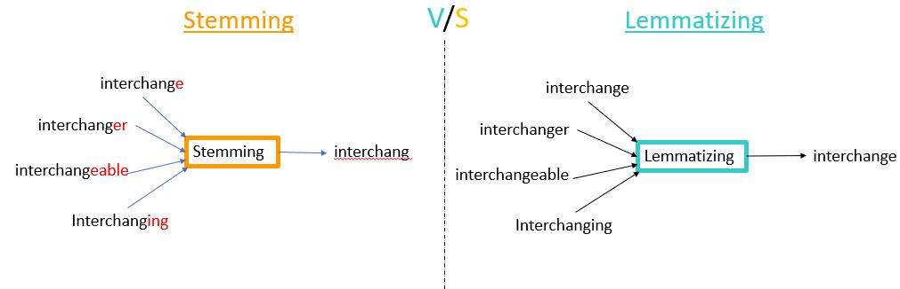

# <u> Text Preprocessing </u>

Text preprocessing in NLP is like getting the text ready for the computer to understand. It's like tidying up a messy room before guests come over. You remove any extra stuff that doesn't matter, like soccer ball, empty bottles or old newspapers. 


Similarly, in text, we might get rid of things like punctuation marks and extra words that don't add much meaning. When computers read and understand human language (like articles, reviews, or tweets), they also need to clean up and organize the words.

<aside>

**_Definition..._**

**_Text preprocessing_** helps computer focus on what's important in the text. It removes things that doesen't help, like extra spaces, symbols, or common words like `the` and `is`. It also makes different forms of words (like `process` and `processing`) become the same, so the computer doesn't get confused.
</aside>


## Text preprocessing techniques
By cleaning up the texts, the computer can understand it better and do cool things like figuring out if people are `happy` or `sad` in reviews, sort news articles into categories, or even translate languages 😍. Now, let's discuss some techniques used in text preprocessing.

### 1. Casing 
_Casing_ refers to the use of `uppercase` (capital) or `lowercase` letters in text. It might not seem like a big deal, but casing can have a significant impact on how computers understand and process language. 

In general, `Kibo` and `kibo` are generally considered to be the same word. However, in NLP, these could be treated as different words if casing is not handled properly. Let's look at an example of why casing is important.

- **Lowercasing**: Many NLP tasks, like text classification or sentiment analysis, doesn't need to distinguish between `Kibo` and `kibo`. By converting all text to lowercase, we treat them as the same word. This helps improve the accuracy and consistency of NLP models.
    - Example: "I want to eat an Apple" → "i want to eat an apple"

- **Maintaining Casing**: In some cases, the casing can carry important information. For instance, if you're analyzing tweets, uppercase words might indicate emphasis or shouting. To retain this information, you might choose not to lowercase the text.

    - Example: "AMAZING DEAL! Get 50% off today!" - preserving casing to capture emphasis.

Now let's look at code examples of converting a text to lowercase using `Spacy`.

<aside>

```python
import spacy

# Load the spaCy English model
nlp = spacy.load("en_core_web_sm")

# Original text with different casings
text1 = "I am learning Data Science at Kibo."
text2 = "AMAZING DEAL! Get 70% off today!"

# Process the text with spaCy
doc1 = nlp(text1)
doc2 = nlp(text2)

# Print tokens and their lowercase forms
print("Original Text 1:", text1)
print("Lowercased Text 1:", " ".join([token.lower_ for token in doc1]))
print()

print("Original Text 2:", text2)
print("Lowercased Text 2:", " ".join([token.lower_ for token in doc2]))
```
...and here's the result of the conversion to lowercase:

    Original Text 1: I am learning Data Science at Kibo.
    Lowercased Text 1: i am learning data science at kibo.

    Original Text 2: AMAZING DEAL! Get 70% off today!
    Lowercased Text 2: amazing deal ! get 70 % off today!
</aside>

### 2. Tokenization

<aside>

**_Definition..._**

**_Tokenization_** in NLP refers to the process of breaking down a text or a sequence of characters into smaller units, known as tokens. For example, consider the sentence: `I love to eat pizza`. 

Tokenization of this sentence would result in the following tokens: `["I", "love", "to", "eat", "pizza", "."]`
</aside>

<div style="position: relative; padding-bottom: 56.25%; height: 0;"><iframe src="https://www.youtube.com/embed/hVOSVlWnl_k" title="Sample Data Science Project" frameborder="0" allow="accelerometer; autoplay; clipboard-write; encrypted-media; gyroscope; picture-in-picture" allowfullscreen style="position: absolute; top: 0; left: 0; width: 100%; height: 100%; border: 2px solid grey;"></iframe></div>

Tokens are essentially the individual words, phrases, or symbols that make up a text. Tokenization is a fundamental step in many natural language processing tasks, as it lays the foundation for further analysis, processing, and understanding of textual data.

For example, let's consider the sentence: `I am studying at Kibo`. Tokenization of this sentence would result in the following tokens:

`"I"` `"am"` `"studying"` `"at"` `"Kibo"` `"."`

Programmatically, we can tokenize a sentence or document with Spacy using the following code snipppet:

<aside>

```python
import spacy

# Load the English language model
nlp = spacy.load("en_core_web_sm")

# Define a text to be tokenized
text = "I love to read books."

# Process the text using spaCy
doc = nlp(text)

# Iterate through tokens and print them
for token in doc:
    print(token.text)
```

...and here's the result of our tokenization:


`| I | am | studying | Intro | to | Data | Science | here | at | Kibo | . |`
</aside>

Each of these tokens represents a discrete unit of meaning, and breaking down the text into tokens enables computers to process and analyze text more effectively.


### 3. Stopwords and punctuation removal
Stopwords are common terms that doesn't contribute much to the meaning of a sentence. For example, `is`, `and`, `the` are stopwords in the English language. Both stopwords and punctions needs to be removed to focus on the more important words in the text.

<aside>

```python
import spacy

# Load the English NLP model
nlp = spacy.load("en_core_web_sm")

# Define a sample text
text = "This is an example sentence containing some common stopwords."

# Process the text using Spacy
doc = nlp(text)

# Remove stopwords from the processed text
processed_text = [token.text for token in doc if not token.is_stop and not token.is_punct]

# Print the filtered words
print(processed_text)
```

...and here is what the output should look like.

```python
['example', 'sentence', 'containing', 'common', 'stopwords']
```
</aside>

In the code snippet above, we loaded the English NLP model from `Spacy`. Then, we define a sample text and process it using the `nlp` object. We iterate through the processed tokens and use the `is_stop`and `is_punct` attribute to check if a token is a stopword or punctuation. If it's not, we add it to the list of processed text.


### 4. Whitespace trimming

Thiclude removing unnecessary spaces, tabs, and newline characters from a text. It can be useful for cleaning and normalizing text data in NLP tasks to ensure consistency and improve the accuracy of NLP models.

Here's an example of how to perform whitespace trimming using `NLTK`:

<aside>

```python
import nltk
from nltk.tokenize import word_tokenize

# Download NLTK data (if not already downloaded)
nltk.download("punkt")

# Input text with extra spaces
text = "   This    is a    text   with   extra   spaces   "

# Tokenize the text using NLTK
tokens = word_tokenize(text)

# Create a new text without extra spaces
trimmed_text = " ".join(tokens)

print(trimmed_text)
```

...and here is what the output should look like.

    This is a text with extra spaces
</aside>

This code snippet will tokenize the input text using `NLTK` and then join the tokens back together to create a new text without the extra spaces.

### 5. Stemming and Lemmatization
Stemming involves reducing words to their base or root form. It removes suffixes from words to get to the core meaning of a word. For example, the stem of the words `interchanger` and `interchanging`  would be `interchang`. This technique reduces words to their root forms to consolidate variations of the same word.



Lemmatization also reduces words to their base form, However it does so in a more intelligent way by considering the context and part of speech of the word, so that the resulting base form (called a `lemma`) is a valid word that makes sense. For example, the stem of the words `interchanger` and `interchanging`  would be `interchange`.

Stemming might produce words that are not actual words, while lemmatization aims to produce meaningful and valid words. 


<aside>

**_Lesson Summary..._**

**_Text preprocessing_** helps computer focus on what's important in the text by removing things that doesen't help, like extra spaces, symbols, or common words like `the` and `is`. It also makes different forms of words (like `process` and `processing`) become the same, so the computer doesn't get confused.

There are different text preprocessing techniques in NLP, however, 5 dof these techniques was discussed in the lesson.
- Case conversion
- Tokenization
- Stopwords and punctuation removal
- Whitespace trimming
- Stemming and lemmatization.
</aside>


<br>

> ➡️ Next, we'll look at `Text representations`... 🎯.
