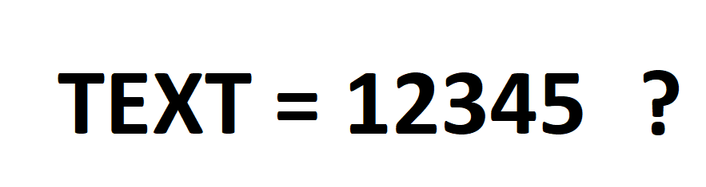

# <u> Text Representations </u>

Since computers can not process text data in it raw form, it becomes inevitable to convert or represent these texts in a format that is suitable for computers. Consuquently, we need some techniques to convert or represent our text for futher processing. _Text representation_ involves transforming raw text data into a format suitable for machine learning models.

<aside>

**_Definition..._**

**_Text representation_** refers to the process of converting raw text into a structured format that machine learning algorithms can understand and process. It involves encoding text data into numerical vectors or matrices.
</aside>

## Text representation techniques

### 1. Bag of Words
Imagine you have a bag, and you want to count how many times different types of fruits are in that bag. You don't care about the order or how they're arranged, just the count of each fruit. This is similar to how the Bag of Words (BoW) works in language.

In BoW, instead of fruits, we have words from a piece of text. We don't care about the order of the words or their context, we're just interested in how many times each word appears. So, we count the frequency of each word and create a list of these word counts. This list of word counts represents our text.

<iframe src="https://www.youtube.com/embed/UFtXy0KRxVI" title="Sample Data Science Project" frameborder="0" allow="accelerometer; autoplay; clipboard-write; encrypted-media; gyroscope; picture-in-picture" allowfullscreen style="position: absolute; top: 0; left: 0; width: 100%; height: 100%; border: 2px solid grey;"></iframe>

For example, let's say we have the sentence: `The sun is shining, the weather is nice`. In the BoW, we would create a list like this:

`The`: 2 times
`sun`: 1 time
`is`: 2 times
`shining`: 1 time
`weather`: 1 time
`nice`: 1 time

This list tells us how many times each word appears in the sentence, without considering the order or meaning of the words. It's a simple way to represent text for tasks like counting word occurrences, **but it doesn't capture the relationships between words or their meanings like more advanced techniques do**.

### 2. TF-IDF
Imagine you have a collection of articles about various topics. You want to figure out which words are important in each article, while also considering how important they are in the entire collection of articles. This is where Term Frequency-Inverse Document Frequency (TF-IDF) comes in. TF-IDF is like a smart way of counting words by considering two things:

- **Term Frequency (TF)**: This measures how often a word appears in a specific article. If a word appears frequently in an article, it's likely important in that context.

- **Inverse Document Frequency (IDF)**: This measures how unique a word is across the entire collection of articles. If a word appears in many articles, it might not be as important because it's common.

<iframe src="https://www.youtube.com/embed/C3V2Lf1Y9Qk?start=8" title="Sample Data Science Project" frameborder="0" allow="accelerometer; autoplay; clipboard-write; encrypted-media; gyroscope; picture-in-picture" allowfullscreen style="position: absolute; top: 0; left: 0; width: 100%; height: 100%; border: 2px solid grey;"></iframe>

In another example, suppose you're analyzing articles about animals, the word `tiger` might have a high `TF-IDF` score because it's frequently mentioned in an article about tigers, but not as common in other articles about different animals. This way, `TF-IDF` helps you focus on the words that truly matter in each article and its context

### 3. Word Embeddings
Word embeddings are like a way for computers to understand words better, just like we humans do. give words meaning by representing them as numbers in a way that captures their relationships. Think of it like a language map: words with similar meanings or related concepts are closer together in this map.

 

<iframe src="https://www.youtube.com/embed/5MaWmXwxFNQ" title="Sample Data Science Project" frameborder="0" allow="accelerometer; autoplay; clipboard-write; encrypted-media; gyroscope; picture-in-picture" allowfullscreen style="position: absolute; top: 0; left: 0; width: 100%; height: 100%; border: 2px solid grey;"></iframe>

In another example, words like `king`, `queen`, `prince`, and `princess` would be closer together because they're related in terms of _royalty_. Similarly, words like `dog` and `cat` would be close because they're related as _pets_.

This technique makes it easier for computers to work with words in more complex tasks, like understanding the sentiment of a sentence, translating languages, or even answering questions from text.

<aside>

**_Lesson Summary..._**

**_Text representation_** refers to the process of converting raw text into a structured format that machine learning algorithms can understand and process. It involves encoding text data into numerical vectors or matrices..

There are different text representation techniques in NLP, however, 3 of these techniques was discussed in the lesson.
- Bag of Word (BoW)
- TF-IDF
- Word embeddings
</aside>

### 👩🏾‍🎨 Practice: Text representation... 🎯

Consider the following dataset of customer reviews for a product:

**Dataset: Customer Reviews**

| ReviewID | CustomerName | ReviewText                                           |
|----------|--------------|-----------------------------------------------------|
| 1        | Alice        | This product is amazing. I highly recommend it.    |
| 2        | Bob          | It's good, but could be better.                    |
| 3        | Carol        | I didn't like it at all.                           |
| 4        | Dave         | Excellent product! I'll buy it again.              |
| 5        | Emily        | It's okay, not great.                              |

Answer the following question:

- Perform Bag of Words (BoW) representation on the given reviews. Create a list of unique words (vocabulary) and indicate the frequency of each word in each review.

 

> ➡️ Next, we'll look at `Sentiment analysis...` 🎯.
